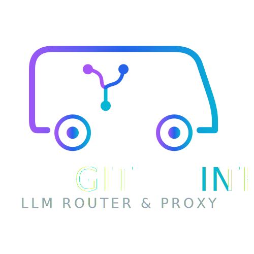

# GitInTheVan



A self-hostable man-in-the-middle LLM router/proxy for roleplay and creative writing. It intercepts OpenAI-compatible chat completion requests, applies transformations (lorebooks, cantrips, verification), and forwards them to your configured LLM endpoint.

Licensed under Mozilla Public License 2.0.

## Why It Exists

I enjoy creative writing, but I spent the early 2000's absorbed in MSN Groups play-by-post roleplay as well as email based play-by-post. I spent a decade doing tabletop gaming online. With my life as hectic as it is, writing with people has become more difficult than I'd like, simply due to scheduling.

But writing with LLMs has allwoed me to explore a ton of concepts and stories in my limited spare time. As such, I have used platforms like SillyTavern, JanitorAI, and others for several years now.

I was growing furstrated with the 'llmisms' - The ocmmon tells of an LLM, along with the struggles around context, persistent memory, and following instructions.

I thougth Lorebary was poised to become a solution to it. I like the idea of a man-in-the-middle proxy. I loved that it was open source, even if it was only for the sake of verification.

My intention had been to contribute to its codebase, but when I finally got around to looking at it in depth I found that it had gone closed-source, becoming yet another 'free' black box AI platform.

This has driven me to build my own properly open-source solution.

I don't have any problems with Lorebary or its creators, I simply believe that an open source solution, especially one that is easy for self-hosting, is the best path forward. GitInTheVan decentralizes and democratizes stricter control over roleplay and creative writing with LLMs.

I will stress that I am not going to replicate or 100% replace Lorebary's functionality. GitInTheVan is a separate tool that is going to work in a similar manner, as a man-in-the-middle instruction management proxy, but the primary focus will be around three things.

**JavaScript empowered Lorebook support** - Lorebooks that are built with JavaScript instead of JSON, executed in a sandbox and with limited functionality. These are NOT JanitorAI Scripts, but it will be compatible with JanitorAI Scripts. I'm calling these Cantrips because they're going to be like small bits of magic compared to the old style lorebooks.

**Persistant memory** - The ability to set limited flags and use memory from one chat to the next, and the ability to have events automatically summarized by a specific model and endpoint using custom prompts.

**LLM validation** - You select a model, it can be a different model than your writing model. You give it its own instructions, either via script/lorebook or just as a system prompt. The LLM evaluates the response it receives from the roleplay endpoint, and if it determines that the bot did not follow instructions, it sends it back automatically up to 'n' times (You set the number of retries) along with an additional instruction. This can include instructions around ensuring the response isn't speaking for the user. It can also include evaluating if the response is accurate for the character - For example, on an adversarial roleplay, ensuring the character doesn't go from 'I hate you' to 'Marry me' in only a handful of messages.

## Features

- **Proxy Router** — Forwards OpenAI-compatible requests to any LLM endpoint (OpenWebUI, OpenRouter, local LLM servers)
- **Multi-User** — Per-user API keys, endpoints, and configurations
- **Lorebooks** — JSON worldbook system with keyword matching, constant/selective entries, enable/disable per lorebook, import from SillyTavern/Chub/JanitorAI formats, and file export
- **Cantrips** — Sandboxed JavaScript execution compatible with JanitorAI scripts, with per-chat persistent storage via `context.chat_data`
- **Verification** — LLM-based response checking with configurable rules, automatic resubmission with retry limits, and verification logs
- **Web UI** — Full management interface built with Svelte 5 including cantrip tester, verification tester, and log viewer

## Upcoming Features

The following are planned for future releases.

- **Persistent Memory** — Zero-width character encoding for state persistence across conversation cycles
- **Chat Memory Summarization** — Opt-in compression of conversation history using a user-selected LLM endpoint
- **Status Streaming** — Real-time pipeline visibility via `<think><gitv>` status blocks when verification is active
- **Simulated Streaming** — Token-speed-controlled output when verification forces non-streaming mode
- **Embedded Creator Lorebooks** — `<jslorebook>` tag extraction from character cards for plug-and-play cantrip support
- **Tagging System** — Activate lorebooks, cantrips, and verification rules via `<#tag#>` delimiters in persona text
- **Cantrip Chaining** — Multi-turn LLM interactions for complex systems like dice resolution and critical tables
- **Command Tags** — Inline tags (`<LORE:name>`, `<VERIFY:off>`) for per-message configuration overrides
- **Content Bypass Plugins** — Provider-specific encoding/decoding for content filtering
- **Debug Mode** — Preserve last N chat exchanges with full pipeline visibility for development
- **Security Hardening** — Rate limiting, CORS hardening, JWT refresh tokens, audit logging
- **Docker Distribution** — Multi-platform container images and docker-compose for production deployment

## Quick Start

### Easy Deploy (Recommended)

For non-technical users, a deploy script handles everything: Python setup, Deno download, frontend build, configuration, and server startup.

**Windows:**
```bash
scripts\deploy-windows.bat
```

**macOS:**
```bash
./scripts/deploy-macos.sh
```

**Linux:**
```bash
./scripts/deploy-linux.sh
```

The script will:
1. Create a Python virtual environment and install dependencies
2. Download Deno automatically (for cantrip sandbox)
3. Build the web UI frontend (requires Node.js 20+)
4. Create a `.env` configuration file from the template
5. Start the server

Once running, open `http://localhost:8000` in your browser.

### Manual Setup

If you prefer to set things up manually or the deploy script doesn't work for your setup:

#### Prerequisites

- Python 3.12+
- Node.js 20+ (for building the frontend)
- [Deno](https://deno.land/) runtime (for cantrip sandbox)

#### Steps

```bash
# Clone and enter the project
cd GitInTheVan

# Create Python virtual environment
python -m venv .venv

# Activate it
.venv\Scripts\activate        # Windows
source .venv/bin/activate     # macOS/Linux

# Install Python dependencies
pip install -e ".[dev]"

# Install Deno (for cantrip sandbox)
# Option A: Download from https://deno.land and place at .deno/deno.exe
# Option B: Install globally and set GITV_DENO_PATH in .env
# Option C: The app auto-detects deno from PATH
# Option D: Let the deploy script download it automatically

# Build the frontend
cd frontend
npm install
npm run build
cd ..

# Configure environment
cp .env.example .env
# Edit .env with your endpoint URL, API key, and secret key

# Start the server
.venv\Scripts\uvicorn app.main:app --reload     # Windows
.venv/bin/uvicorn app.main:app --reload          # macOS/Linux
```

Open `http://localhost:8000` in your browser to access the management UI.

### First Run

1. Navigate to `http://localhost:8000`
2. Click "First run? Setup admin" to create your admin account
3. Save your `gitv_` API key — this is used for proxy requests
4. Go to **Endpoints** and add your LLM endpoint
5. Go to **Settings** and set your default endpoint
6. Point your client (JanitorAI, etc.) at `http://localhost:8000/v1/chat/completions` using your `gitv_` API key

## Configuration

### Environment Variables (`.env`)

| Variable | Default | Description |
|----------|---------|-------------|
| `GITV_SECRET_KEY` | `change-me` | JWT signing secret. Change in production. |
| `GITV_DEBUG` | `false` | Enable debug logging |
| `GITV_LOG_LEVEL` | `INFO` | Log level (DEBUG, INFO, WARNING, ERROR) |
| `GITV_DATABASE_URL` | `sqlite+aiosqlite:///./data/gitinthevan.db` | Database URL |
| `GITV_DENO_PATH` | *(auto)* | Path to Deno binary for cantrip sandbox |
| `GITV_DEFAULT_ENDPOINT_URL` | *(empty)* | Fallback endpoint URL (used when no `gitv_` API key is provided) |
| `GITV_DEFAULT_ENDPOINT_API_KEY` | *(empty)* | Fallback endpoint API key |
| `GITV_DEFAULT_ENDPOINT_MODEL` | *(empty)* | Fallback model name |
| `GITV_DEFAULT_ENDPOINT_API_BASE_PATH` | *(empty)* | Fallback API base path (e.g. `/api` for OpenWebUI) |
| `GITV_REQUEST_TIMEOUT` | `300` | Request timeout in seconds |

### Endpoints

Endpoints support a custom **API Base Path** field. Most OpenAI-compatible APIs use `/v1` (the default). OpenWebUI and some other platforms use `/api` instead. You can paste the full URL (e.g. `https://example.com/api/chat/completions`) when creating an endpoint and the path will be auto-detected.

### Client Configuration

Point any OpenAI-compatible client at:

```
URL:  http://localhost:8000/v1/chat/completions
Key:  gitv_<your-api-key>
```

For JanitorAI: set the Reverse Proxy URL to the above and use your `gitv_` key as the API key.

## Using with JanitorAI

1. In JanitorAI settings, go to API configuration
2. Set API to "OpenAI" mode
3. Set the Reverse Proxy URL to `http://localhost:8000/v1/chat/completions`
4. Set the API key to your `gitv_` key
5. Select your model

All requests will flow through GitInTheVan, applying any configured lorebooks, cantrips, and verification rules.

## Cantrips (JavaScript Lorebooks)

Cantrips are sandboxed JavaScript snippets that run in a Deno subprocess with no network, filesystem, or environment access. They are compatible with existing JanitorAI scripts.

### JanitorAI Context API

```javascript
const lastMessage = context.chat.last_message;
const messageCount = context.chat.message_count;
const charName = context.character.name;

// Modify character context (append-only recommended)
context.character.scenario += " Additional world context.";
context.character.personality += ", additional trait";
```

### GitInTheVan Extensions

```javascript
// Per-chat persistent storage (survives across cycles)
const day = context.chat_data.get('day') || 1;
context.chat_data.set('day', day + 1);

console.log('Debug output visible in cantrip tester');
```

### Testing Cantrips

Use the Cantrip Tester in the web UI (Cantrips page) to run a cantrip against sample context without forwarding to an LLM.

## Verification

Verification checks LLM responses against configurable rules using a separate LLM call:

1. LLM produces a response
2. The response is sent to a verification LLM with your rule prompt
3. If the response violates the rule, the request is resubmitted with corrective instructions
4. Retries are limited (configurable per rule, default 2)

**Note:** When verification is enabled, responses are buffered (non-streaming) to allow checking before returning to the client.

## Development

### Project Structure

```
GitInTheVan/
  app/
    models/       SQLAlchemy ORM models
    routers/      API route handlers
    services/     Business logic (proxy, cantrips, lorebooks, verification)
    main.py       FastAPI entry point
  frontend/
    src/          Svelte 5 source
  tests/          pytest test suite
  static/         Built frontend (generated)
```

### Building the Frontend

After any UI change:

```bash
cd frontend
npm run build
```

This outputs to `../static/`. Restart the Python server to pick up changes.

### Running Tests

```bash
.venv\Scripts\python -m pytest tests\ -v
```

### Linting

```bash
.venv\Scripts\ruff check app\ tests\
```

## Starting Out With Cantrips

I created a ton of 'Scripts' for JanitorAI before they started purging long-time creators due to fresh new interpretations of old rules. You can find them at [Tydorius/JanitorAI_Scripts](https://github.com/Tydorius/JanitorAI_Scripts). There is also a skill file for creating your own.

Note that they use different mechanisms for persistent memory, essentially passing data into the prompt. They are heavily reliant on the LLM to follow instructions, moreso than GitInTheVan will rely on them. They also expect no post-LLM Scripts, so the Scripts are written expecting User > Script > LLM > User. Cantrips will support User > Script > LLM > Verification LLM > Script > User.

## Getting Support

Feel free to open issues for feature requests or bug reports. For bug reports, the more information you can provide the better.

## Giving Suport

If you like what I do, you can donate to me on ko-fi.

[ko-fi.com/tydorius](https://ko-fi.com/tydorius)

## Disclaimer: Use of AI

I am a cloud architect. I design and build systems for a living. I've been programming and scripting for thirty years, and I've been doing graphic design for nearly as long starting in Photoshop 6.0.

I utilized GLM 5.x for parts of this project. I utilized Gemini 3.5 to generate the SVG logo. This is an open source project that is free for personal use, and with my schedule it was only possible through the assistance of artificial intelligence.

I have no qualms about using AI in my work.

AI is not the enemy. Corporations are the enemy. One person not hiring an artist is not killing the art industry, it's corporations that are training models off stolen data and firing entire art departments en masse that are hurting the art industry. The same goes for all affected industries from authors to programmers. The same was true when robots became a core part of manufacturing.

Corporations are the ones that laid off workers without benefits. Corporations are the ones lobbying against rights. Corporations are the ones that keep us in the quagmire of supply and demand, late-stage capitalism, and existential suffering. We have the technology to have clean air, clean water, plentiful food, and plentiful shelter. We could be in a post-scarcity society right now, but greed holds us back.

I make use of the tools I have available.

## License

Mozilla Public License 2.0 — See [LICENSE](LICENSE)