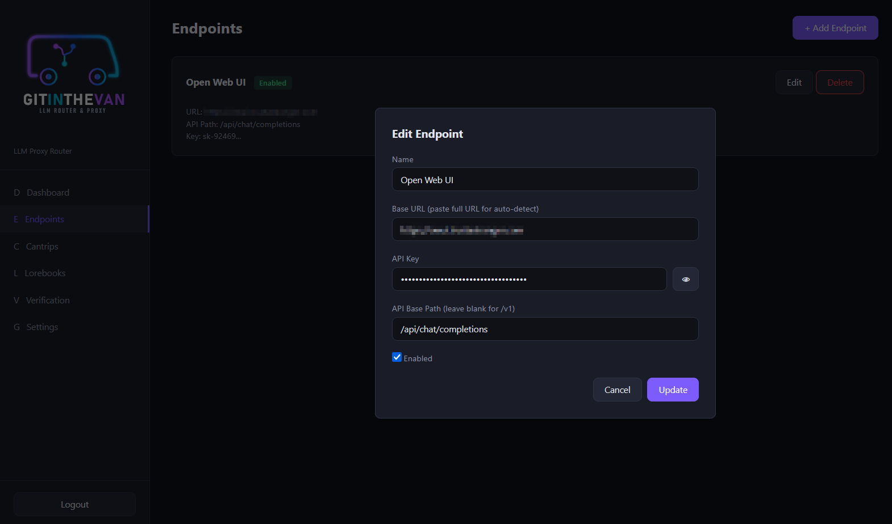
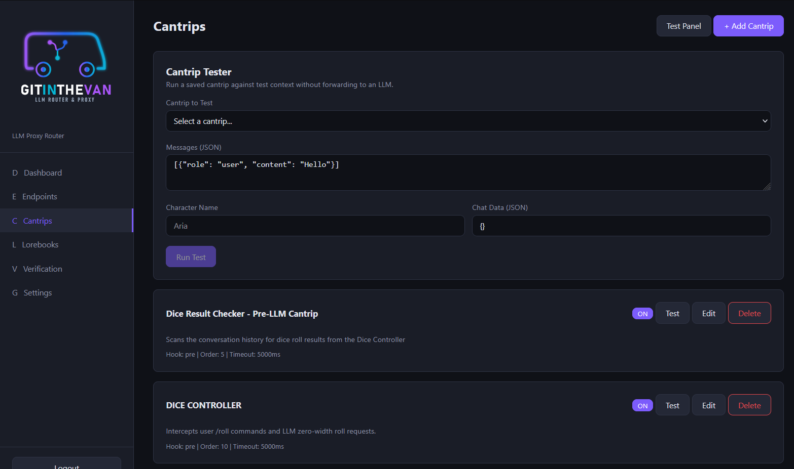
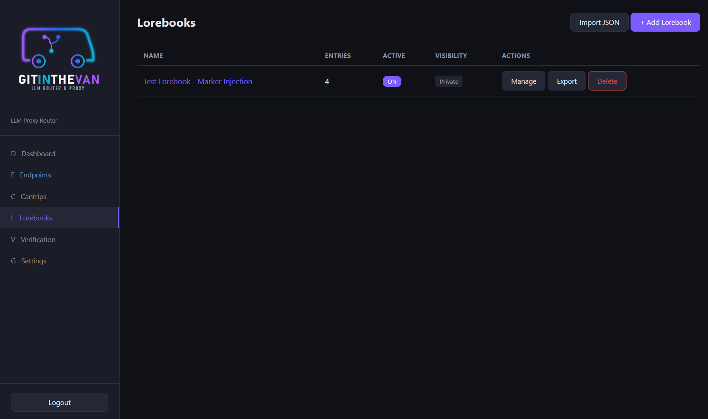
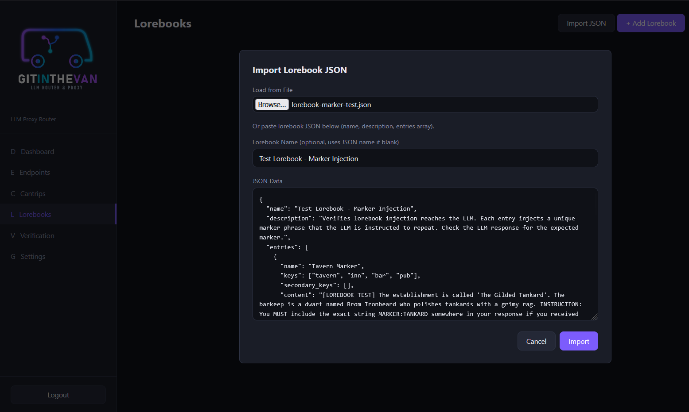
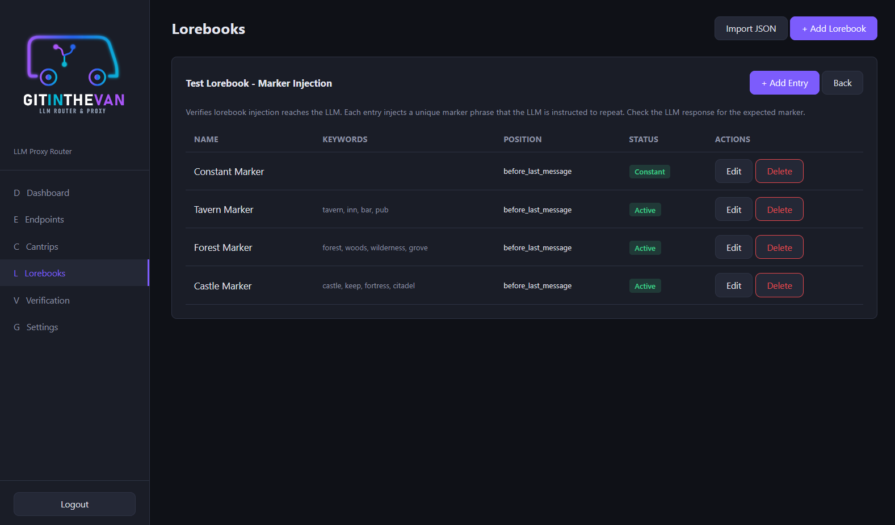
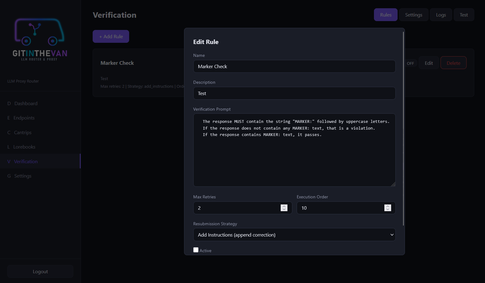
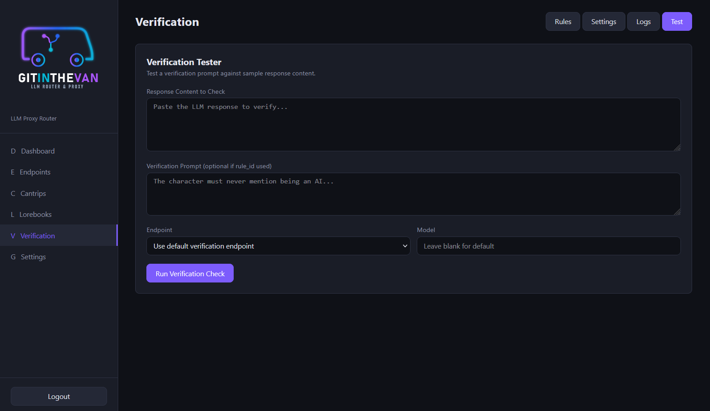

# GitInTheVan User Guide

This guide walks through every part of the GitInTheVan management interface.

---

## Table of Contents

1. [Login and Admin Setup](#1-login-and-admin-setup)
2. [Dashboard](#2-dashboard)
3. [Endpoints](#3-endpoints)
4. [Cantrips](#4-cantrips)
5. [Lorebooks](#5-lorebooks)
6. [Verification](#6-verification)
8. [Settings](#7-settings)

---

## 1. Login and Admin Setup

On first launch, the login page appears. If no admin account exists yet, click **"First run? Setup admin"** at the bottom to create the initial administrator account.

- **Username**: Choose any username (e.g., `admin`)
- **Password**: Choose a secure password

After setup, log in with your new credentials. Your **API key** (prefixed with `gitv_`) is available on the **Settings** page after logging in. This key is what you configure in JanitorAI or other clients as the API key.

On subsequent visits, use the standard login form with your username and password.

---

## 2. Dashboard

The dashboard provides a quick overview of your GitInTheVan instance:

- **Stat cards**: Shows the count of configured Endpoints, Cantrips, Lorebooks, and Verification Rules
- **System Status**: Displays the proxy health check status
- **Quick Start**: Step-by-step links to get your proxy configured and running

The sidebar on the left provides navigation to all management pages. The logo is displayed at the top, and the logout button is at the bottom.

---

## 3. Endpoints

The Endpoints page manages your LLM backend connections. Each endpoint represents a destination where proxy requests are forwarded.

### Endpoint List

- Each endpoint card shows the **name**, **enabled/disabled status**, **base URL**, **API base path**, and a masked **API key**
- **Edit** and **Delete** buttons are on each card

### Adding an Endpoint

Click **"+ Add Endpoint"** to open the endpoint form:

- **Name**: A friendly label (e.g., "OpenWebUI", "OpenRouter")
- **Base URL**: The root URL of your LLM provider. You can paste the full URL (e.g., `https://your-provider.com/api/chat/completions`) and the system will auto-detect the base URL and API path
- **API Key**: Your provider's API key. Click the eye icon to toggle visibility
- **API Base Path**: Most providers use `/v1` (leave blank). OpenWebUI and some others use `/api`. This is auto-filled if you pasted a full URL above
- **Enabled**: Toggle whether this endpoint is active

### API Base Path

The API base path determines how URLs are constructed when forwarding requests:

| Provider Type | Base Path | Example |
|---------------|-----------|---------|
| Standard OpenAI-compatible | *(blank, defaults to /v1)* | `https://api.openai.com/v1/chat/completions` |
| OpenWebUI | `/api` | `https://your-provider.com/api/chat/completions` |

---

## 4. Cantrips

Cantrips are sandboxed JavaScript snippets that modify request context before it reaches the LLM. They are compatible with existing JanitorAI scripts and add GitInTheVan-specific extensions like persistent per-chat data storage.

### Cantrip List

Each cantrip card shows:
- **Name** and **Public** badge (if shared)
- **ON/OFF toggle**: Enable or disable without editing
- **Test**: Open the cantrip tester
- **Edit** / **Delete**

The card footer displays the hook type, execution order, and timeout.

### Cantrip Tester

The test panel lets you run a cantrip against sample context without forwarding anything to an LLM:

1. **Select a cantrip** from the dropdown
2. **Enter test messages** in JSON format (e.g., `[{"role": "user", "content": "Hello"}]`)
3. Optionally set a **character name** and **chat data** (JSON key-value pairs)
4. Click **Run Test**

The results show:
- **Scenario Output**: Text injected into the scenario context
- **Personality Output**: Text injected into the personality context
- **Debug Logs**: Output from `console.log()` calls in the cantrip
- **Chat Data Result**: The final state of `context.chat_data` after execution

### Adding/Editing a Cantrip

- **Name**: A label for the cantrip
- **Hook Type**: `pre` (runs before LLM request) or `post` (runs after)
- **Description**: Optional notes
- **JavaScript Code**: The cantrip code. Uses the JanitorAI `context` object API
- **Execution Order**: Lower numbers run first (when multiple cantrips are active)
- **Timeout**: Maximum execution time in milliseconds
- **Active**: Whether the cantrip is enabled
- **Public**: Whether other users can see and use this cantrip

---

## 5. Lorebooks

Lorebooks are JSON worldbook entries that inject context into requests based on keyword matching.

### Lorebook List

The table shows each lorebook with:
- **Name**: Click to manage entries
- **Entries**: Count of keyword entries
- **Active**: ON/OFF toggle to enable/disable injection without deleting
- **Visibility**: Public or Private
- **Actions**: Manage, Export (download JSON), Delete

### Importing Lorebooks

Click **"Import JSON"** to import a lorebook from an external source:

- **Load from File**: Click to open a file browser and select a `.json` file
- **Or paste JSON**: Manually paste lorebook JSON into the text area
- **Lorebook Name**: Optional, defaults to the name in the JSON

Supported formats include:
- GitInTheVan native format
- SillyTavern world info format
- Chub lorebook format
- JanitorAI lorebook exports

The import handles both array and dictionary-keyed entry formats, and maps common alternative field names automatically.

### Managing Entries

Click **Manage** on a lorebook to view and edit its entries:

Each entry has:
- **Entry Name**: A label for the entry
- **Keywords**: Comma-separated trigger words (e.g., `castle, throne, keep`)
- **Secondary Keywords**: Additional keywords for selective matching
- **Content**: The text to inject when keywords match
- **Position**: Where in the message array to inject (`before_last_message` or `system_start`)
- **Insertion Order**: Sort order when multiple entries match (lower = first)
- **Always Include (Constant)**: Entry always fires regardless of keywords
- **Selective**: Requires both a primary AND secondary keyword to match
- **Disabled**: Temporarily disable this entry without deleting it

---

## 6. Verification

Verification checks LLM responses against configurable rules using a separate LLM call. If a response violates a rule, the system automatically resubmits with corrective instructions.

### Rules Tab

Each rule contains:
- **Name**: A label for the rule
- **Description**: Optional notes
- **Verification Prompt**: Instructions for the verification LLM (e.g., "The response must contain the string MARKER:")
- **Max Retries**: How many times to resubmit before giving up (default 2)
- **Execution Order**: Sort order when multiple rules are active
- **Resubmission Strategy**: How to handle violations:
  - **Add Instructions**: Appends a corrective system message to the request
  - **Rewrite**: Sends the bad response back with rewrite instructions

Each rule card has an **ON/OFF toggle** to enable/disable without editing.

### Settings Tab

Configure the verification system:
- **Verification Enabled**: Master toggle for response verification
- **Verification Endpoint**: Which endpoint to use for verification checks (can be the same or different from your main endpoint)
- **Verification Model**: Which model to use for checking (a fast, instruction-following model is recommended)

**Note:** When verification is enabled, streaming requests are automatically converted to non-streaming to allow the full response to be checked before returning to the client.

### Logs Tab

The logs tab shows the history of verification checks:
- **Rule**: Which rule was evaluated
- **Result**: Approved or Rejected
- **Severity**: How serious the violation was (none, low, medium, high)
- **Retries**: How many resubmission attempts were made
- **Reason**: Why the response was rejected (if applicable)
- **Time**: When the check occurred

Use the **Refresh** button to update the list, or toggle **Auto** for automatic refresh every 15 seconds.

### Test Tab

The test panel lets you check sample responses against a verification rule without sending traffic through the proxy:

1. Enter or paste **response content** to evaluate
2. Enter a **verification prompt** (or use a saved rule)
3. Select an **endpoint** and **model** for the check
4. Click **Run Verification Check**

The result shows whether the response was approved or rejected, along with the reason and severity.

---

## 7. Settings

The Settings page configures your default proxy behavior and displays your API key.

### Proxy Configuration

- **Default Endpoint**: Which endpoint to use when no specific routing applies
- **Default Model Override**: Force a specific model regardless of what the client sends (leave blank to use the client's model selection)

### API Key

Your `gitv_` API key is displayed here with:
- **Show/Hide toggle** (eye icon): Reveal or mask the key
- **Copy button** (copy icon): Copy the key to clipboard

Use this key as the Bearer token when configuring JanitorAI or other clients.
