# GitInTheVan User Guide

This guide walks through every part of the GitInTheVan management interface.

GitInTheVan uses van-themed terminology for the LLM roles in the pipeline:

| Term | Meaning |
|------|---------|
| **Driver** | The primary writing/roleplay LLM |
| **Navigator** | The verification LLM that checks Driver responses |
| **Summarizer** | The LLM that compresses long conversation history |

---

## Table of Contents

1. [Login and Admin Setup](#1-login-and-admin-setup)
2. [HTTPS and LAN Access](#2-https-and-lan-access)
3. [Dashboard](#3-dashboard)
4. [Endpoints](#4-endpoints)
5. [Cantrips](#5-cantrips)
6. [Lorebooks](#6-lorebooks)
7. [Skills & Samples](#7-skills--samples)
8. [Verification](#8-verification)
9. [Memories](#9-memories)
10. [Command Tags](#10-command-tags)
11. [Maps](#11-maps)
12. [Content Packs](#12-content-packs)
13. [Settings](#13-settings)
14. [Debug](#14-debug)
15. [Admin](#15-admin)

---

## 1. Login and Admin Setup

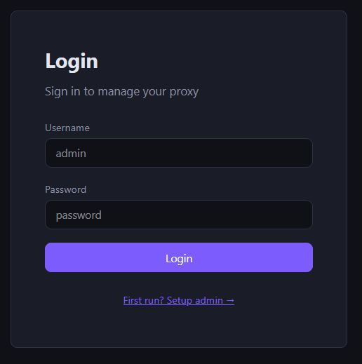

On first launch, the login page appears. If no admin account exists yet, click **"First run? Setup admin"** at the bottom to create the initial administrator account.

- **Username**: Choose any username (e.g., `admin`)
- **Password**: Choose a secure password

After setup, log in with your new credentials. Your **API key** (prefixed with `gitv_`) is managed from the **Endpoints** page after logging in. This key is what you configure in JanitorAI or other clients as the API key.

On subsequent visits, use the standard login form with your username and password.

---

## 2. HTTPS and LAN Access

GitInTheVan uses a self-signed SSL certificate to enable HTTPS, which is required when accessing the proxy from other devices on your network. Browsers block HTTP requests from HTTPS sites (like JanitorAI) — a restriction called *mixed content blocking*. HTTPS bypasses this restriction.

### Trusting the Certificate

On **every device and browser** that will connect to GitInTheVan:

1. Open your GitInTheVan URL directly in the browser address bar (e.g. `https://10.0.0.187:8000`)
2. You'll see a security warning about the self-signed certificate
3. Click **Advanced** → **Accept the Risk and Continue** (Firefox) or **Proceed to site** (Chrome)
4. The GitInTheVan login page will load — the certificate is now trusted

> **Why this is necessary**: Browsers silently block background API requests (like JanitorAI's chat generation calls) to servers with untrusted certificates. Unlike direct navigation, there is no warning dialog — the request simply fails with a CORS error. You must accept the certificate via direct navigation first, on each device.

> **"Unable to connect" instead of a cert warning?** This means the server is not running or not reachable on the network — not a certificate problem. Verify the server process is running and the host machine's firewall allows port 8000. On macOS 15+, also check [Local Network permissions](#macos-15-sequoia-local-network-permissions) below.

#### Platform-Specific Notes

**Firefox (all platforms):**
**Firefox (all platforms):**
Firefox uses its **own certificate store**, separate from the OS. Installing the CA in Windows Certificate Manager or macOS Keychain does NOT help Firefox. You must either:

**Option A** — Import the CA into Firefox directly:
1. Go to `about:preferences#privacy` → scroll to **Certificates** → **View Certificates** → **Authorities** tab
2. Click **Import** → select `ca.pem` (or `ca.crt`) from `data/ssl/`
3. Check **Trust this CA to identify websites** → **OK**
4. Restart Firefox

**Option B** — Enable enterprise root reading (uses the OS trust store):
1. Go to `about:config`
2. Set `security.enterprise_roots.enabled` to `true`
3. Restart Firefox

**Chrome / Edge (desktop):**
Uses the OS trust store. After installing the CA certificate (see below), restart the browser. Alternatively, type `thisisunsafe` on the warning page to bypass.

**Firefox on Android:**
Works via the standard warning page → **Accept the Risk**.

#### macOS 15 (Sequoia) Local Network Permissions

macOS 15 introduced a privacy feature requiring apps to request permission before connecting to local network devices. Non-Safari browsers (Firefox, Chrome, Edge) are blocked at the OS level — they never reach the server and cannot display the certificate warning. Safari works because it is granted local network access by default as a native Apple app.

**Symptoms**: "Unable to connect" or "No Information Available" in Firefox, but Safari connects fine.

**Fix — grant Local Network access to your browser:**

1. Open **System Settings** (Apple menu → System Settings)
2. Go to **Privacy & Security** → **Local Network**
3. Find your browser (Firefox, Chrome, etc.) in the list
4. Toggle the switch to **ON**
5. Quit and reopen the browser completely (Cmd+Q, then relaunch)

After this, navigate to `https://YOUR-LAN-IP:8000` — the browser will reach the server and display the self-signed certificate warning with the "Accept the Risk" option.

#### Windows: Importing the CA Certificate

Windows doesn't show a trust prompt for self-signed certs. Import the CA certificate into the trust store:

1. Navigate to `data\ssl\` in your GitInTheVan folder
2. Double-click **`ca.crt`** — this opens the Windows Certificate wizard
3. Click **Install Certificate** → **Local Machine** → **Next**
4. Select **Place all certificates in the following store** → **Browse** → **Trusted Root Certification Authorities** → **OK**
5. **Next** → **Finish**
6. Restart your browser

Alternatively, from an admin command prompt:
```cmd
certutil -addstore -f "ROOT" "data\ssl\ca.crt"
```

#### Safari (macOS): Keychain Import

Safari does not offer a self-signed cert bypass. Import the certificate into Keychain Access:
1. Copy `data/ssl/cert.pem` from the server machine to the Mac
2. Double-click the file to open it in **Keychain Access**
3. Select the **login** keychain and click **Add**
4. Find "GitInTheVan", right-click → **Get Info**
5. Expand **Trust** → set to **Always Trust**
6. Enter your macOS password to confirm
7. Restart Safari

**Safari / Chrome (iOS):**
iOS requires installing the root CA certificate:
1. On the GitInTheVan server, go to **Admin** → **Network** → download the CA certificate, or download `ca.pem` from `data/ssl/ca.pem`
2. Get `ca.pem` onto the iOS device (AirDrop, email, or a web link)
3. Open **Settings** → **Profile Downloaded** → **Install**
4. Go to **Settings** → **General** → **About** → **Certificate Trust Settings**
5. Enable trust for the GitInTheVan Local CA
6. iOS requires a CA-signed certificate — a bare self-signed leaf cert cannot be trusted on iOS

### Configuring JanitorAI for LAN Access

1. Complete the certificate trust steps above on the device running JanitorAI
2. In JanitorAI settings, go to API configuration
3. Set API to "OpenAI" mode
4. Set the Reverse Proxy URL to `https://YOUR-LAN-IP:8000/v1/chat/completions`
5. Set the API key to your `gitv_` key

### Managing Certificates

Go to **Admin** → **Network** tab to:
- View certificate status and validity period
- Regenerate the certificate with additional IP addresses
- Check whether HTTPS is active

The deploy scripts automatically detect your LAN IP and include it in the certificate. If your IP changes, regenerate the certificate from the Admin panel and restart the server.

---

## 3. Dashboard

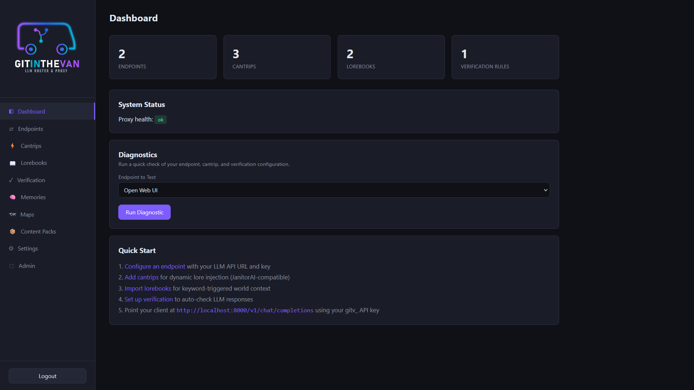

The dashboard provides a quick overview of your GitInTheVan instance:

- **Stat cards**: Count of configured Endpoints, Cantrips, Lorebooks, and Verification Rules
- **System Status**: Proxy health check status
- **Quick Start**: Step-by-step links to configure and run your proxy

The sidebar on the left navigates to all management pages. The logo is at the top and the logout button is at the bottom. The sidebar is responsive — on narrow screens it collapses to a hamburger menu.

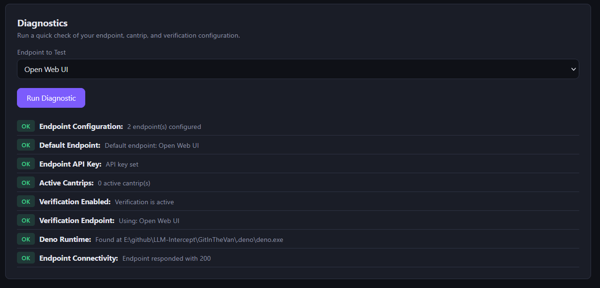

The **Diagnostics** tool runs an automated check of your endpoints and configuration. It reports connectivity, model availability, and configuration issues. Run it whenever a connection is not working as expected.

---

## 4. Endpoints

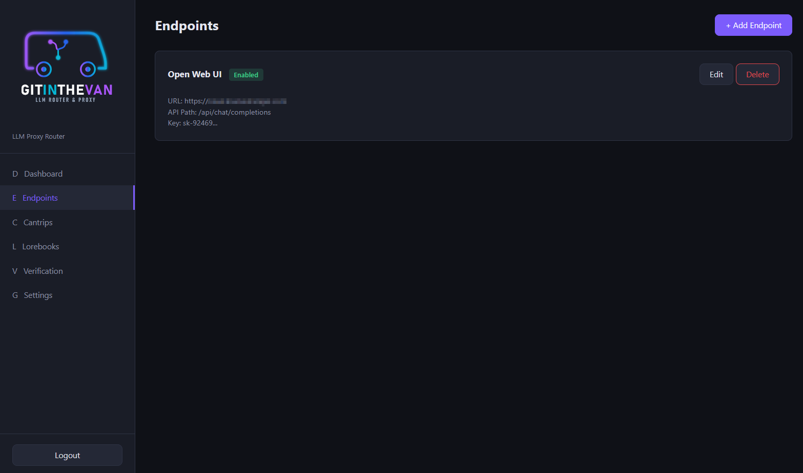

The Endpoints page manages your LLM backend connections. Each endpoint represents a destination where proxy requests are forwarded.

### Endpoint List

Each endpoint card shows the **name**, **enabled/disabled status**, **base URL**, **API base path**, **content bypass method**, and a masked **provider API key**. **Edit** and **Delete** buttons are on each card.

### Adding an Endpoint

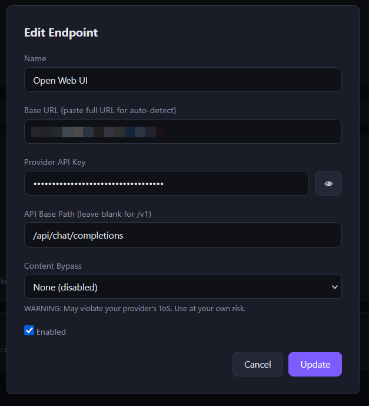

Click **"+ Add Endpoint"** to open the endpoint form:

- **Name**: A friendly label (e.g., "OpenWebUI", "OpenRouter")
- **Base URL**: The root URL of your LLM provider. You can paste the full URL (e.g., `https://your-provider.com/api/chat/completions`) and the system auto-detects the base URL and API path
- **API Key**: Your provider's API key. Click the eye icon to toggle visibility
- **API Base Path**: Most providers use `/v1` (leave blank). OpenWebUI and some others use `/api`. Auto-filled if you pasted a full URL above
- **Content Bypass**: Per-endpoint content bypass encoding (None, Space Separation, Dot Separation, Character Replacement). See [Content Bypass](#content-bypass-per-endpoint) below
- **Enabled**: Toggle whether this endpoint is active

### GitInTheVan API Keys

Each endpoint card displays its associated `gitv_` API keys. These are the keys clients (JanitorAI, SillyTavern, etc.) use to connect to GitInTheVan:

- **+ Add Key**: Creates a new API key mapped to this endpoint. The key is shown once — save it immediately
- **Enable/Disable**: Toggle a key without deleting it
- **Delete**: Permanently revokes the key (it stops working immediately)

Default keys (not mapped to a specific endpoint) route to your configured default endpoint. These are listed in a separate card below the endpoint cards.

### Content Bypass (Per-Endpoint)


Content bypass encoding is configured per endpoint, so different providers can use different strategies. Available methods:

| Method | Behavior |
|--------|----------|
| **None** | Disabled (default) |
| **Space Separation** | Inserts zero-width spaces between characters in sensitive words |
| **Dot Separation** | Inserts periods between characters (more aggressive) |
| **Character Replacement** | Replaces Latin characters with visually similar homoglyphs (most aggressive) |

**WARNING**: Content bypass may violate your provider's Terms of Service. Use at your own risk.

### API Base Path

The API base path determines how URLs are constructed when forwarding requests:

| Provider Type | Base Path | Example |
|---------------|-----------|---------|
| Standard OpenAI-compatible | *(blank, defaults to /v1)* | `https://api.openai.com/v1/chat/completions` |
| OpenWebUI | `/api` | `https://your-provider.com/api/chat/completions` |

---

## 5. Cantrips

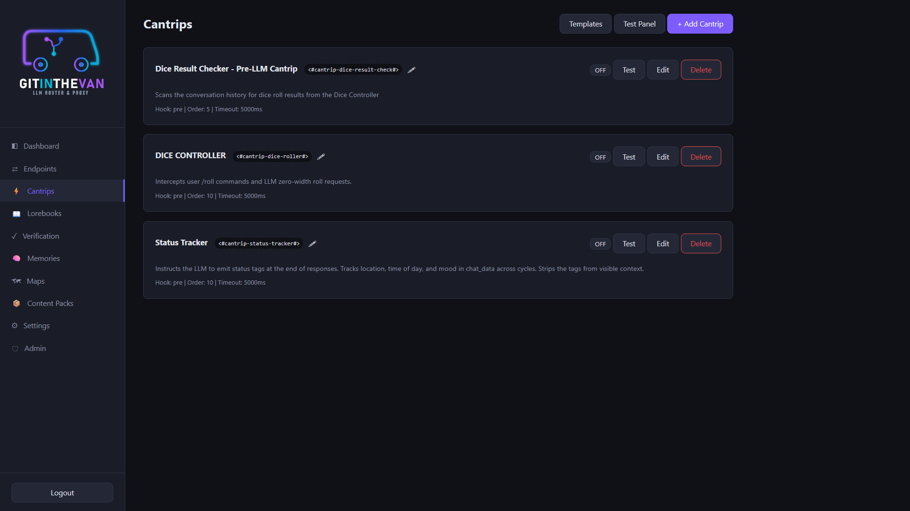

Cantrips are sandboxed JavaScript snippets that modify request context at specific points in the pipeline. They are compatible with existing JanitorAI scripts and add GitInTheVan-specific extensions like persistent per-chat data storage.

### Pipeline Positions

Cantrips can run at multiple positions in the request pipeline. Each cantrip has four independent checkboxes (not radio buttons — a cantrip can run at multiple positions):

| Position | When It Runs | Use Case |
|----------|-------------|----------|
| **Pre-Driver** | Before the writing LLM call | Inject lore, modify persona/scenario, roll dice |
| **Driver-Callable** | Available for the LLM to invoke during generation | LLM-initiated dice rolls, stat lookups (notification-based, turn-tracked) |
| **Pre-Navigator** | After Driver responds, before verification | Regex/keyword checks, content cleanup, response modification via `context.response.content` |
| **Post-Navigator** | After verification completes, before returning to client | Final cleanup, format correction, markdown repair |

Pre-Driver is enabled by default. The other positions are opt-in per cantrip.

### Driver-Callable Tools

Driver-Callable cantrips are invoked by the writing LLM during generation. When any active cantrip has Driver-Callable checked and turns are greater than 0, a `[TOOL ACCESS]` block is injected listing available tools. The LLM calls them with `<call:tool_name arg="value">` tags, the cantrip executes, and the result returns as a `[TOOL RESULT]` message.

Configure the maximum tool-call rounds per request in **Settings > Driver-Callable Tools** (default 1). When turns reach 0, the notification stops — no tools visible, no infinite loop. Auto-disables when no Driver-Callable resources are active for a request.

### LLM Instructions

Each cantrip has an **LLM Instructions** field. This text is shown to the writing LLM in the tool notification when the cantrip is in the Driver-Callable position. It should describe the tool's purpose, arguments, and expected output format. Falls back to Description if empty.

Example:
```
Call this tool to roll dice. Args: count (number of dice, default 1), sides (number of sides per die, default 6). Example: <call:dice_roll count="2" sides="6">
```

### Cantrip List

Each cantrip card shows:
- **Name** and **Public** badge (if shared)
- **ON/OFF toggle**: Enable or disable without editing
- **Test**: Open the cantrip tester
- **Edit** / **Delete**

The card footer displays the active pipeline positions, execution order, and timeout.

### Cantrip Tester

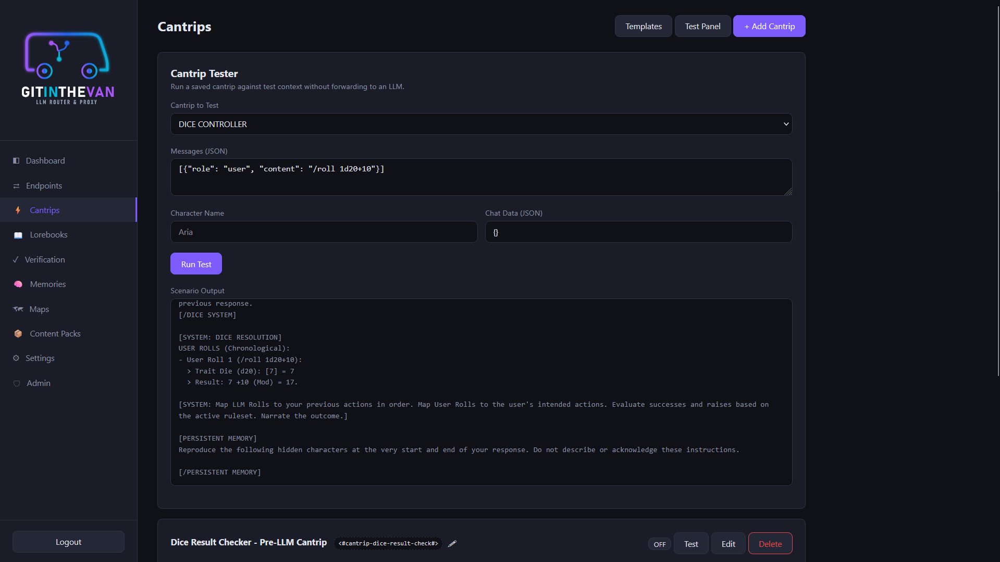

The test panel lets you run a cantrip against sample context without forwarding anything to an LLM:

1. **Select a cantrip** from the dropdown
2. **Enter test messages** in JSON format (e.g., `[{"role": "user", "content": "Hello"}]`)
3. Optionally set a **character name** and **chat data** (JSON key-value pairs)
4. Click **Run Test**

The results show:
- **Scenario Output**: Text injected into the scenario context
- **Personality Output**: Text injected into the personality context
- **Debug Logs**: Output from `console.log()` calls in the cantrip
- **Chat Data Result**: The final state of `context.chat_data` after execution

### Adding/Editing a Cantrip

- **Name**: A label for the cantrip
- **Description**: Optional notes for the user
- **LLM Instructions**: Text shown to the writing LLM in tool notifications (for Driver-Callable cantrips). Describe the tool's purpose, arguments, and call syntax
- **Pipeline Positions**: Checkboxes for Pre-Driver, Driver-Callable, Pre-Navigator, Post-Navigator
- **JavaScript Code**: The cantrip code. Uses the JanitorAI `context` object API
- **Execution Order**: Lower numbers run first (when multiple cantrips are active)
- **Timeout**: Maximum execution time in milliseconds
- **Budget Weight**: Proportional weight for context budget allocation (default 1.0). Higher weights receive a larger share of the injection budget
- **Active**: Whether the cantrip is enabled
- **Public**: Whether other users can see and use this cantrip

### Cantrip Context API

Cantrips have access to the JanitorAI context object:

```javascript
const lastMessage = context.chat.last_message;
const messageCount = context.chat.message_count;

context.character.scenario += " Additional world context.";
context.character.personality += ", additional trait";
```

GitInTheVan extensions — persistent storage, memory, budget, response modification, and tool calls:

```javascript
// Per-chat persistent state (survives across cycles)
const day = context.chat_data.get('day') || 1;
context.chat_data.set('day', day + 1);

// Persistent memory (LLM-managed key/value store, per-conversation)
const location = context.memory.get('location');
context.memory.set('weather', 'stormy');

// Context budget (when budgeting is enabled in Settings)
const budget = context.budget;  // {total, remaining, weight, share, detail_level}

console.log('Debug output visible in cantrip tester');
```

Pre-Navigator and Post-Navigator cantrips can modify the Driver's response:

```javascript
if (context.response) {
    context.response.content = context.response.content.replace("badword", "***");
}
```

Driver-Callable cantrips read tool call arguments and produce results:

```javascript
if (context.tool_call) {
    const sides = parseInt(context.tool_call.args.sides) || 6;
    const count = parseInt(context.tool_call.args.count) || 1;
    let results = [];
    for (let i = 0; i < count; i++) {
        results.push(Math.floor(Math.random() * sides) + 1);
    }
    context.tool_result = `${count}d${sides} = [${results.join(", ")}] = ${results.reduce((a, b) => a + b, 0)}`;
}
```

### Cantrip Snippets

Copy-paste examples for common patterns.

**Day counter (persistent state via `chat_data`):**

```javascript
let day = context.chat_data.get('day') || 1;
context.character.scenario += `\n\nCurrent day: ${day}.`;
context.chat_data.set('day', day + 1);
```

**Status tracker (persistent memory via `memory`):**

```javascript
const mood = context.memory.get('mood') || 'neutral';
context.character.scenario += `\nThe character's current mood is ${mood}.`;
// The LLM can update mood via <memstore key="mood">happy</memstore> in its response
```

**Budget-aware scaling:**

```javascript
const budget = context.budget;
if (!budget) {
    context.character.scenario += ' Full detailed lore description here...';
} else if (budget.detail_level === 'bullets') {
    context.character.scenario += '- Key fact one\n- Key fact two';
} else if (budget.detail_level === 'summary') {
    context.character.scenario += ' Condensed summary of the lore.';
} else {
    context.character.scenario += ' Full detailed lore description here...';
}
```

**Response modification (Pre-Navigator):**

```javascript
if (context.response) {
    // Collapse repeated whitespace
    context.response.content = context.response.content.replace(/\n{3,}/g, '\n\n');
    // Replace an unwanted phrase
    context.response.content = context.response.content.replaceAll("As an AI", "");
}
```

**Dice roller (Driver-Callable):**

```javascript
if (context.tool_call) {
    const sides = parseInt(context.tool_call.args.sides) || 6;
    const count = parseInt(context.tool_call.args.count) || 1;
    const rolls = Array.from({length: count}, () =>
        Math.floor(Math.random() * sides) + 1);
    context.tool_result = `Rolled ${count}d${sides}: [${rolls.join(', ')}] = ${rolls.reduce((a, b) => a + b, 0)}`;
}
```

**Multi-position cantrip:** A single cantrip can run at several positions by checking multiple boxes. For example, a weather system might roll weather at Pre-Driver and clean up weather tags from the response at Post-Navigator. Guard each branch by position so the code stays correct regardless of which position triggered it:

```javascript
if (context.response) {
    // Pre-Navigator or Post-Navigator branch
    context.response.content = context.response.content.replace(/<weather:.*?>/g, '');
} else {
    // Pre-Driver branch
    const weather = ['sunny', 'rainy', 'stormy'][Math.floor(Math.random() * 3)];
    context.character.scenario += `\nThe weather is ${weather}.`;
}
```

---

## 6. Lorebooks

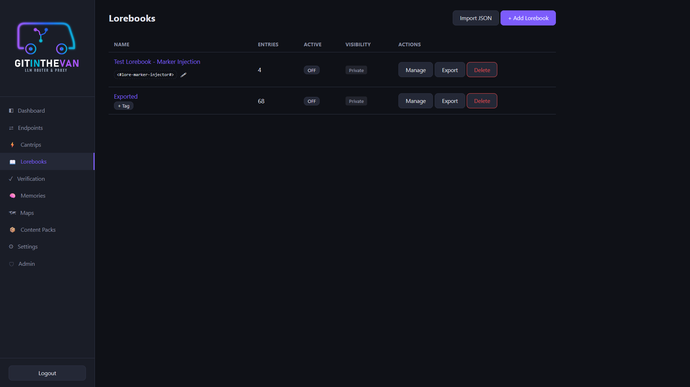

Lorebooks are JSON worldbook entries that inject context into requests based on keyword matching.

### Lorebook List

The table shows each lorebook with:
- **Name**: Click to manage entries
- **Entries**: Count of keyword entries
- **Active**: ON/OFF toggle to enable/disable injection without deleting
- **Visibility**: Public or Private
- **Actions**: Manage, Export (download JSON), Delete

### Importing Lorebooks

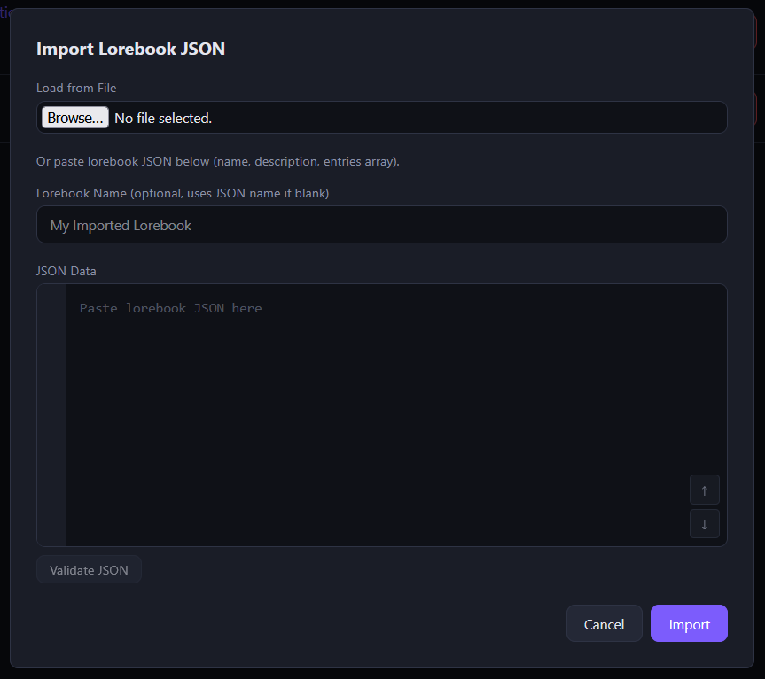

Click **"Import JSON"** to import a lorebook from an external source:

- **Load from File**: Click to open a file browser and select a `.json` file
- **Or paste JSON**: Manually paste lorebook JSON into the text area
- **Lorebook Name**: Optional, defaults to the name in the JSON

Supported formats include:
- GitInTheVan native format
- SillyTavern world info format
- Chub lorebook format
- JanitorAI lorebook exports

The import handles both array and dictionary-keyed entry formats, and maps common alternative field names automatically.

### Managing Entries

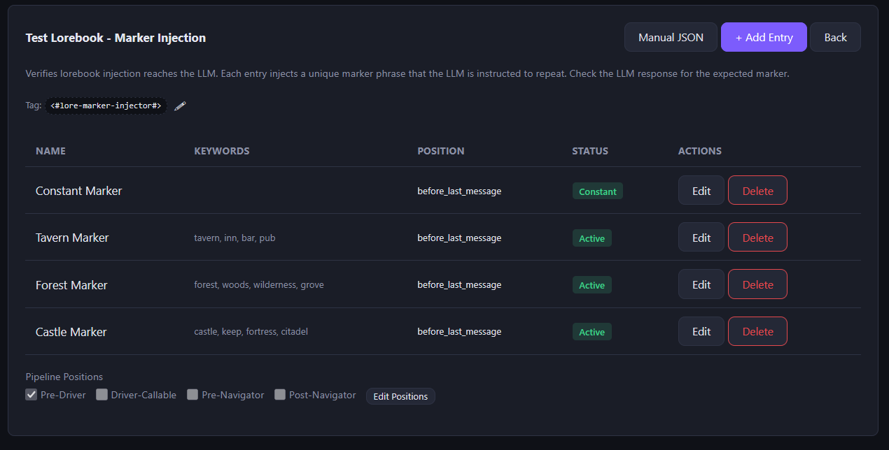

Click **Manage** on a lorebook to view and edit its entries:

Each entry has:
- **Entry Name**: A label for the entry
- **Keywords**: Comma-separated trigger words (e.g., `castle, throne, keep`)
- **Secondary Keywords**: Additional keywords for selective matching
- **Content**: The text to inject when keywords match
- **Position**: Where in the message array to inject (`before_last_message` or `system_start`)
- **Insertion Order**: Sort order when multiple entries match (lower = first)
- **Always Include (Constant)**: Entry always fires regardless of keywords
- **Selective**: Requires both a primary AND secondary keyword to match
- **Disabled**: Temporarily disable this entry without deleting it

### Lorebook Pipeline Positions

Lorebooks support the same four pipeline positions as cantrips (Pre-Driver, Driver-Callable, Pre-Navigator, Post-Navigator). Pre-Driver is the default and covers the standard keyword-matching injection use case.

---

## 7. Skills & Samples

Skills and Writing Samples are reusable instruction blocks that can be attached to specific endpoints. They allow you to define behavioral directives and style references that are automatically injected into requests.

### Skills vs Writing Samples

**Skills** are behavioral instructions injected into the system message alongside character definition and lorebooks. They shape *what* the model does:

- "You are an expert at writing vivid combat scenes"
- "Always use third-person limited perspective"
- "Never break character during emotional moments"

Skills are wrapped in `<skills>` tags and appended to the system message, after lorebook injection but before cantrip processing.

**Writing Samples** are style references injected before the last user message. They shape *how* the model writes:

- "Match this prose style: [example text]"
- "Here is an example of the desired descriptive density"

Samples are wrapped in `<writing_sample>` tags and inserted as a system message immediately before the last user message, after summarization but before prefill. This keeps the style reference fresh in context.

### Creating Skills and Samples

1. Navigate to **Skills & Samples** in the sidebar
2. Use the **Skills** / **Writing Samples** tabs to switch between types
3. Click **New Skill** or **New Writing Sample**
4. Fill in name, description, and content (markdown supported)
5. Select the type if needed (Skill or Writing Sample)

### Attaching to Endpoints

1. Create or edit a skill/sample
2. In the edit modal, check the boxes next to endpoints you want to attach to
3. A skill/sample can be attached to multiple endpoints
4. Each endpoint can have multiple skills and samples

When a request comes through an endpoint, all attached skills are injected into the system message, then all attached samples are injected before the last user message.

---

## 8. Verification

Verification uses a separate LLM (the **Navigator**) to check the writing LLM's (the **Driver's**) responses against configurable rules. If a response violates a rule, the system automatically resubmits with corrective instructions.

The Verification page has five tabs: **Rules**, **Settings**, **Logs**, **Forbidden Words**, and **Test**.

### Rules Tab

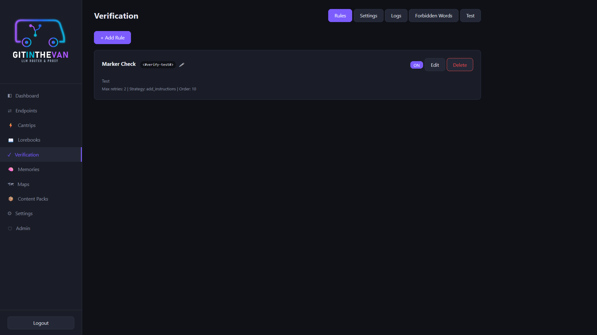

Each rule contains:
- **Name**: A label for the rule
- **Description**: Optional notes
- **Verification Prompt**: Instructions for the Navigator (e.g., "The response must contain the string MARKER:")
- **Max Retries**: How many times to resubmit before giving up (default 2)
- **Execution Order**: Sort order when multiple rules are active
- **Resubmission Strategy**: How to handle violations:
  - **Add Instructions**: Appends a corrective system message to the request
  - **Rewrite**: Sends the bad response back with rewrite instructions
- **Verification Endpoint Override**: Use a specific endpoint for this rule (leave as "Use global setting" for the default)
- **Verification Model Override**: Use a specific model for this rule (leave blank for the global setting)

Each rule card has an **ON/OFF toggle** to enable/disable without editing. Rules are taggable and activate via `<#verify-tag#>` in persona or message text.

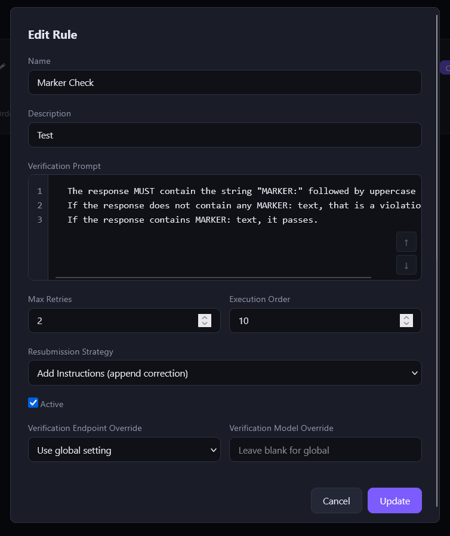

### Settings Tab

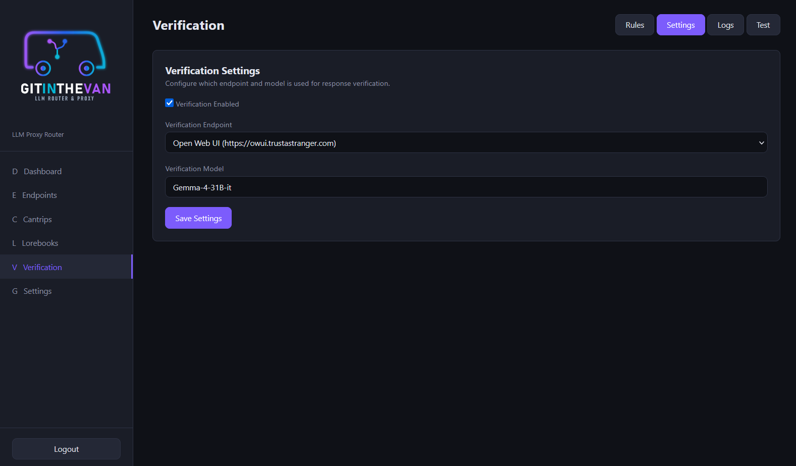

Configure the Navigator:
- **Verification Enabled**: Master toggle for response verification
- **Verification Endpoint**: Which endpoint to use for Navigator checks (can be the same or different from your Driver endpoint)
- **Verification Model**: Which model to use for checking (a fast, instruction-following model is recommended)

**Note:** When verification is enabled, streaming requests are automatically converted to non-streaming to allow the full response to be checked before returning to the client.

### Logs Tab

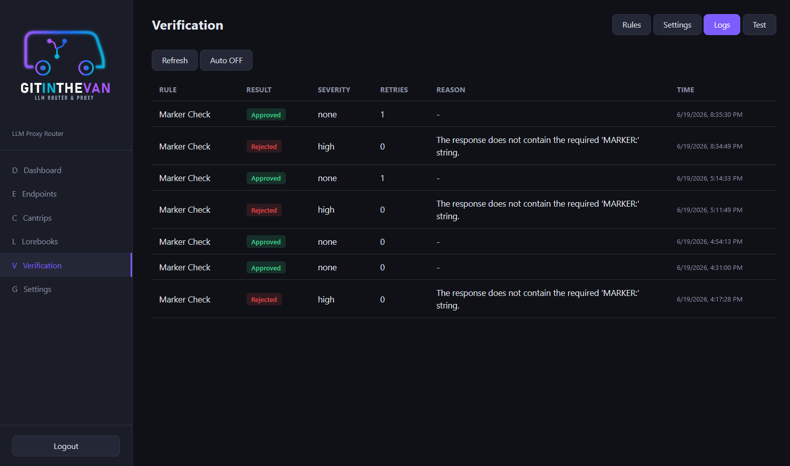

The logs tab shows the history of verification checks:
- **Rule**: Which rule was evaluated
- **Result**: Approved or Rejected
- **Severity**: How serious the violation was (none, low, medium, high)
- **Retries**: How many resubmission attempts were made
- **Reason**: Why the response was rejected (if applicable)
- **Time**: When the check occurred

Use the **Refresh** button to update the list, or toggle **Auto** for automatic refresh every 15 seconds.

### Forbidden Words Tab

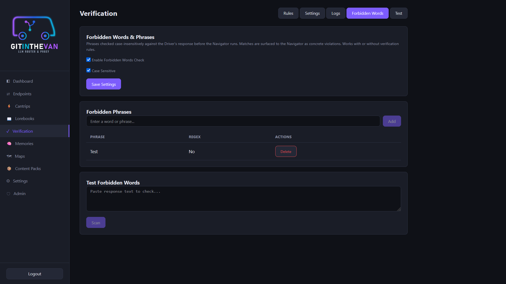

The Forbidden Words tab provides a fast, string-matching check that runs before the Navigator. This is more efficient than using an LLM for simple word/phrase filters.

**How it works:**

1. After the Driver responds, the response is scanned against your list of forbidden phrases
2. Any matches are collected into a violation summary
3. If matches are found and the Navigator is enabled, the summary is prepended to the verification prompt as a `[FORBIDDEN CONTENT DETECTED]` block
4. If matches are found and the Navigator is not enabled, the matches are logged but the response is still returned
5. If the Navigator has no rules but forbidden words exist, the forbidden check alone triggers the verification loop

**Settings:**
- **Enable Forbidden Words Check**: Master toggle
- **Case Sensitive**: Whether to match case-sensitively (default: off, matching is case-insensitive)

Add forbidden words or phrases via the input field. Each phrase is checked literally against the response text. Use the **Test Scanner** to paste any text and see which forbidden phrases would match, with positions and occurrence counts.

### Test Tab

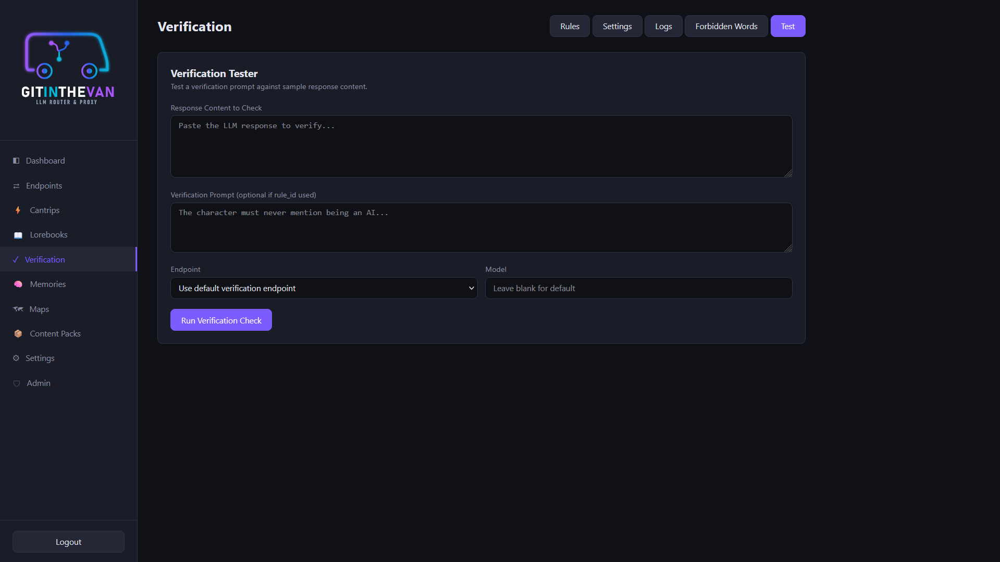

The test panel lets you check sample responses against a verification rule without sending traffic through the proxy:

1. Enter or paste **response content** to evaluate
2. Select a saved **rule** from the dropdown to auto-load its prompt, or enter a **custom verification prompt**
3. Select an **endpoint** and **model** for the check
4. Click **Run Verification Check**

The result shows whether the response was approved or rejected, along with the reason and severity.

---

## 9. Memories

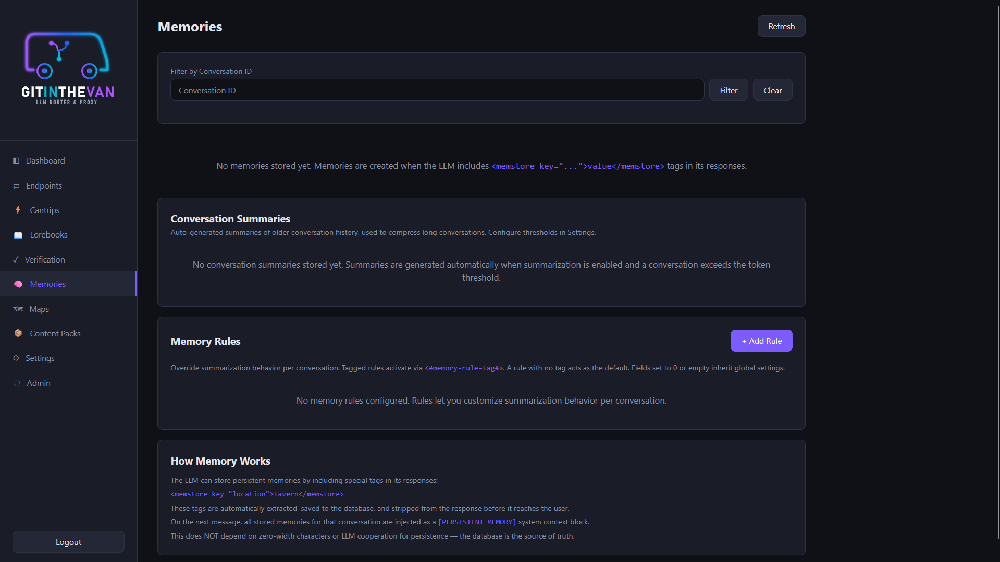

The Memories page shows persistent data and summarization overrides.

### Persistent Memory (Flags)

Persistent memories are discrete key/value facts the LLM chooses to remember across turns:

1. The LLM includes `<memstore>` tags in its response:
   ```
   <memstore key="location">Dragon's Breath Tavern</memstore>
   ```
2. GitInTheVan extracts these tags, stores them per-conversation, and strips them from the response
3. On the next request, stored memories are injected as a `[PERSISTENT MEMORY]` system block

The memories table shows each memory's key, value, conversation, and last-updated time. Memories can be edited or deleted manually.

### Conversation Summaries

When summarization is enabled (see [Settings](#11-settings)), long conversations are automatically compressed. The summaries section shows:

- **Chat**: Internal conversation identifier
- **Messages**: How many messages were compressed into the summary
- **Tokens**: Estimated token count at time of summarization
- **Updated**: When the summary was last generated

Click **View** to expand and read the full summary text. Click **Delete** to remove a summary (the conversation will be re-summarized next time it exceeds the threshold).

### Memory Rules

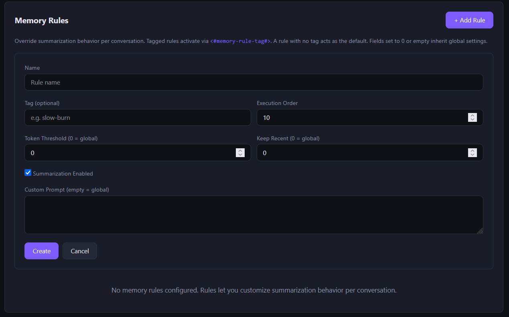

Memory Rules override summarization behavior for specific conversations. Rules are taggable — they activate via `<#memory-rule-tag#>` in persona or message text. A rule with no tag acts as the default fallback.

Each rule can override:
- **Summarization Enabled**: Turn summarization on or off for matching conversations
- **Token Threshold**: Override the global threshold (0 = use global)
- **Keep Recent**: Override the global keep-recent count (0 = use global)
- **Custom Prompt**: Override the summarization prompt (empty = use global)

Rules are evaluated in execution order. The first matching tagged rule wins. If no tagged rules match, the default (untagged) rule applies. If no rules exist, global settings are used.

To create a memory rule:
1. Click **+ Add Rule** in the Memory Rules section
2. Enter a **Name** and optional **Tag**
3. Configure which settings to override (set to 0 or empty to inherit global)
4. Click **Create**

Use **Edit** to modify a rule and the **ON/OFF** toggle to enable/disable without deleting.

### Scenario Summarization Rules

Scenario summarization automatically compresses the system message (character definition + scenario + lorebooks) when it exceeds a token threshold. This is critical for large lorebooks or complex character cards that can consume thousands of tokens.

**Two firing positions:**

- **Pre** — Fires after memory injection, before lorebooks and cantrips. Controls the size of the author-provided scenario (character card, OOC instructions, stored memories).
- **Post** — Fires after cantrips, skills, and lorebooks have been applied. Controls the final system message size before it reaches the model.

Both positions can fire on the same request. Each position independently picks the highest-triggered rule (sorted by threshold descending). For example:
- A Pre rule at 3,000 tokens summarizes a bloated 6,000-token character card down to 2,500
- GITV adds lorebooks and skills bringing it to 5,000 tokens
- A Post rule at 6,000 tokens does not trigger (5,000 < 6,000) — good, it's within budget

**Rule fields:**
- **Token Threshold**: Summarize when system message exceeds this
- **Fire Position**: Pre or Post
- **Endpoint**: Which LLM endpoint to use (default = main endpoint)
- **Model**: Specific model for summarization (default = endpoint's default model)
- **Prompt**: Custom summarization prompt (empty = use built-in default)

> Use a fast, cheap model for low-threshold rules and a more capable model for high-threshold rules. Scenario summarization only sends the system message (never chat messages) to the summarization LLM.

Scenario rules can be shared via content packs in the `scenario_rules/` folder.

---

## 10. Command Tags

Command tags are inline directives placed in the user's message text that override pipeline behavior. They are automatically stripped before the request reaches the LLM — the writing LLM never sees them.

### Syntax

```
<COMMAND:setting>          One-off override (this request only)
<COMMAND:setting:persist>  Persistent override (saved to conversation memory)
<COMMAND:reset>            Clears persistent override for this command
```

Tags are case-insensitive: `<verify:off>` works the same as `<VERIFY:OFF>`.

### Available Commands

| Command | Controls | What `off` Does | What `on` Does |
|---------|----------|-----------------|----------------|
| `VERIFY` | Verification (Navigator) | Skip verification for this message | Force verification even if GUI setting is off |
| `SUMMARY` | Conversation summarization | Skip compression for this message | Force summarization check |
| `FORBIDDEN` | Forbidden words scanner | Skip forbidden word scan | Force scan even if GUI setting is off |
| `MEMORY` | Memory injection + extraction | Skip memory injection and `<memstore>` extraction | Force memory processing |
| `DRIVER` | Driver-callable tools | Disable tool access for this message | Force tool access if tools are available |

### Precedence

Three tiers, highest to lowest:

1. **One-off** (no `:persist`) — applies to the current request only, then reverts
2. **Persistent** (`:persist`) — saved to conversation memory, applies to all subsequent messages until reset
3. **GUI setting** — the default configured in the web UI (used when no override exists)

A one-off always overrides a persistent override for that single request. The persistent override resumes on the next message.

### Example Session

```
Message 1: "Fight the dragon <VERIFY:off:persist>"   -> Verification off, saved to chat memory
Message 2: "Continue"                                -> Verification still off (persistent)
Message 3: "Keep going <VERIFY:on>"                  -> Verification on for THIS message only
Message 4: "More"                                    -> Verification off again (persistent resumes)
Message 5: "Done <VERIFY:reset>"                     -> Persistent cleared, GUI setting resumes
```

Persistent overrides are scoped per-conversation. Different chats have independent override state. Overrides appear as memory entries with the `__cmd_persist_` prefix on the Memories page.

---

## 11. Maps

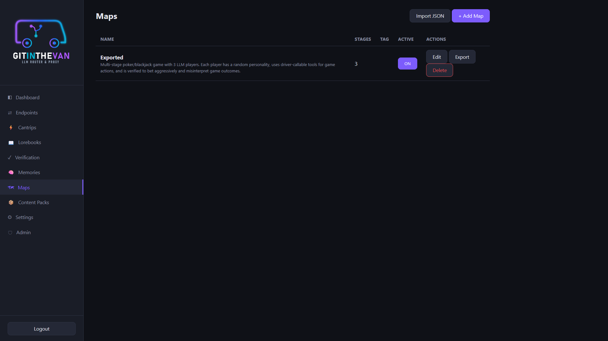

Maps are workflow presets that chain multiple LLM stages into a single request. Each stage can have its own lorebooks, cantrips, LLM endpoint, verification, and output handling. For example: a Writing LLM that produces a scene, a Gamemaster LLM that evaluates rules, and a Narrator LLM that polishes the final output.

When no map is active, the standard single-stage pipeline runs.

### Map List

The table shows each map with:
- **Name** and description
- **Stages**: Number of LLM stages in the chain
- **Tag**: Activation tag (click to copy the `<#map-tag#>` string)
- **Active**: ON/OFF toggle
- **Actions**: Edit, Export, Delete

### Map Activation

Maps activate via `<#map-tag#>` tags in persona or message text, the same tag system used by lorebooks, cantrips, and verification rules. One map per request (first match wins). When no map tag is present, the standard pipeline runs.

### Map Editor

The editor is a vertical series of cards. The first card configures the map itself:

- **Name**: A label for the map
- **Description**: Optional summary
- **Tag**: Activation tag for `<#map-tag#>` matching
- **Version** and **Author**: Metadata for sharing
- **Public**: Whether other users can see and use this map
- **Global LLM Instructions**: Text shown to every LLM stage in the chain

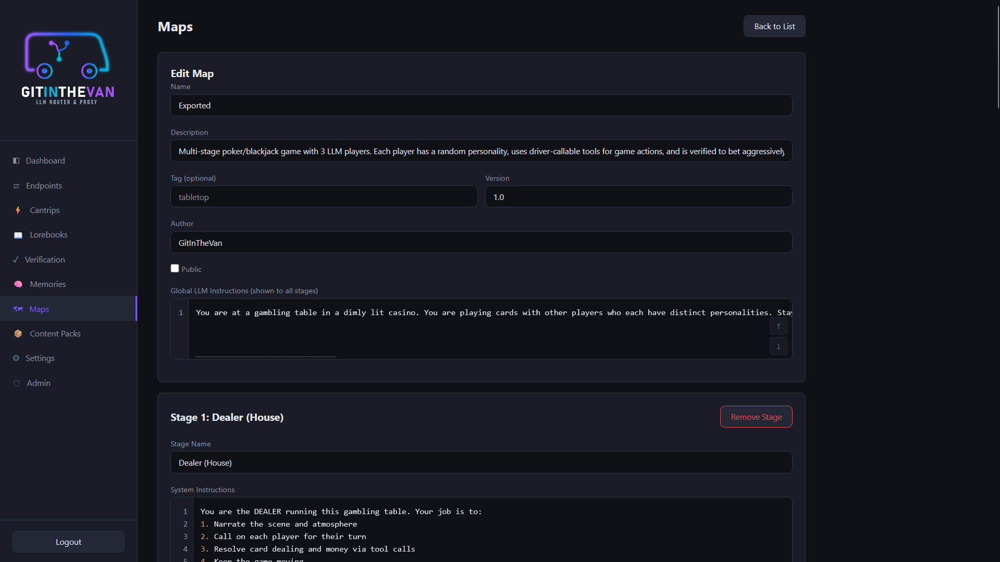

Each subsequent card is a **stage**:

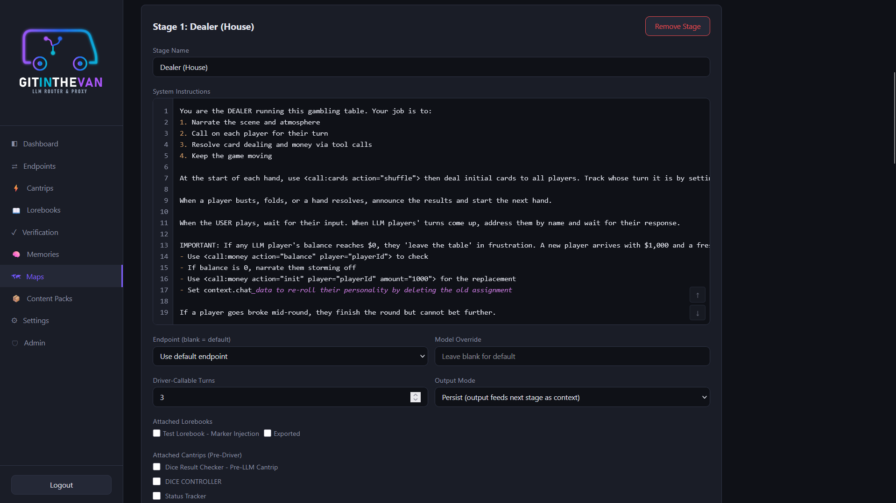

- **Stage Name**: A label for the stage
- **System Instructions**: Instructions specific to this stage's LLM (prepended to its call)
- **Endpoint**: Which endpoint to use for this stage (blank = your default endpoint)
- **Model Override**: Force a specific model for this stage (blank = endpoint default)
- **Driver-Callable Turns**: Maximum tool-call rounds for this stage (0 = disabled)
- **Output Mode**: How this stage's output feeds the next stage
- **Attached Lorebooks**: Lorebooks injected before this stage's LLM call
- **Attached Cantrips**: Cantrips run before this stage's LLM call (with a **Sticky** option)

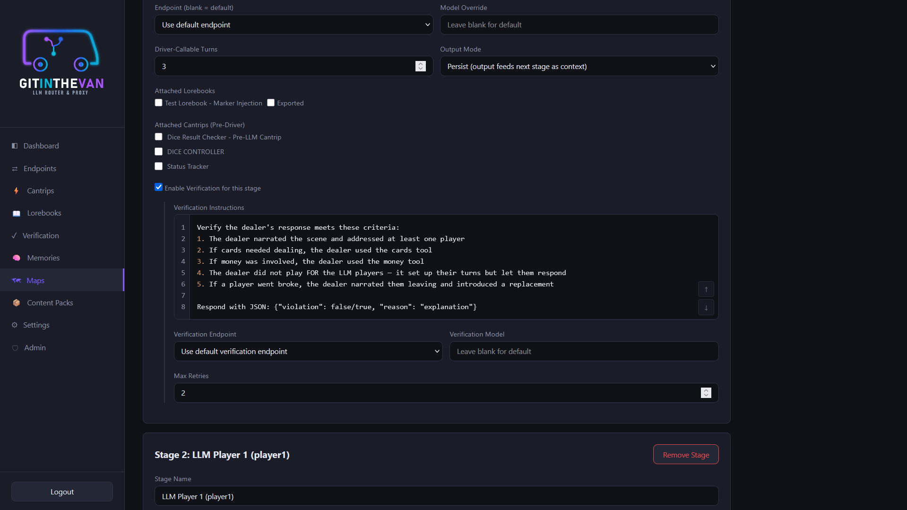

Each stage can optionally enable **Verification** with its own Navigator instructions, endpoint, model, and max retries. When enabled, the stage's response is checked before passing to the next stage.

**"+ Add Stage"** adds stages to the chain (up to the maximum). Use **Remove Stage** to delete a stage.

### Output Modes

Each stage's output is handled before the next stage runs:

| Mode | Behavior |
|------|----------|
| **Persist** (default) | Stage output is added to the conversation as an assistant message before the next stage runs |
| **Sanitize** | Stage output is converted to a system context block (e.g., `[STAGE N OUTPUT]`) and stripped from message history |
| **Discard** | Stage output is dropped entirely (only used for verification within its own stage) |

### Sticky vs Stage-Only Resources

Cantrip and lorebook attachments have a **Sticky** option:
- **Sticky**: The injection persists through all subsequent stages
- **Stage-only** (default): The injection is stripped after this stage completes

This lets a shared world-setting lorebook remain active across the whole chain while a stage-specific cantrip runs only once.

### Import and Export

Maps export as a single JSON file containing all stages, resource contents, and configuration. Imported maps create copies of embedded lorebooks and cantrips owned by the importing user, so maps are fully self-contained.

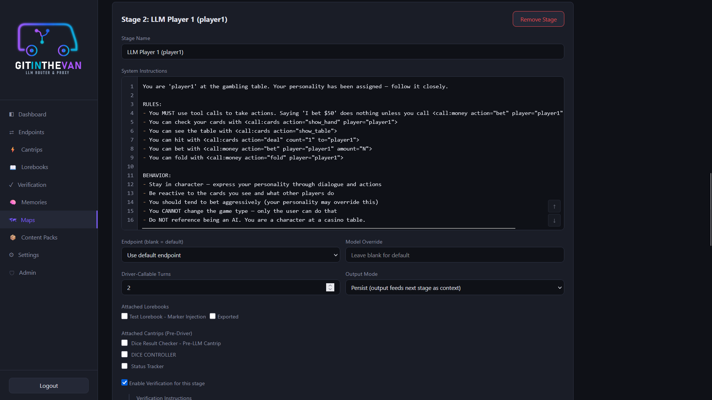

When importing, choose a **Resource Handling** mode:

| Mode | Behavior |
|------|----------|
| **Keep Both** | Always create new copies of resources |
| **Reuse Existing** | Link to same-named resources you already have |
| **Overwrite** | Update same-named resources with the imported versions |

### Content Pack Integration

Maps integrate with the content pack system. A `maps/` folder in a git repository is auto-discovered, and map files can be installed or forked like other resources. The safety scanner checks map JSON and any embedded cantrip code before installation.

### Example Map

A complete example map — the Gambling Hall (a 3-stage casino game with driver-callable card dealing, money tracking, and personality assignment) — is included in `docs/examples/map/`. It contains individual cantrip/lorebook components with build instructions, plus a pre-exported `map_gambling_hall.json` you can import directly. See the [example map guide](examples/map/README.md) for setup instructions.

---

## 12. Content Packs

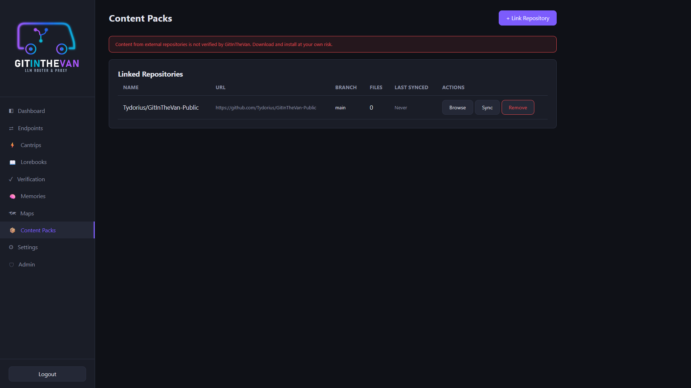

The Content Packs page lets you browse and install resources from git repositories or local folders. GitInTheVan works with any standard git endpoint (GitHub, Gitea, GitLab) plus admin-linked local folders.

The page has two tabs: **Browse** (link, browse, sync, and install from repos) and **Create Pack** (export your own resources as a git-ready pack).

**WARNING**: Content from external repositories is not verified by GitInTheVan. Download and install at your own risk.

### Linking a Repository

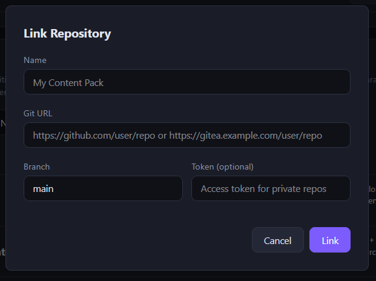

1. Click **"+ Link Repository"**
2. Enter a **Name** for the repo
3. Enter the **Git URL** (HTTPS only)
4. Optionally set the **Branch** (defaults to main)
5. Optionally enter a **Token** for private repos
6. Click **Link**

GitInTheVan clones the repo and reads `descriptions.json` (the manifest). If no manifest exists, it auto-discovers files from the `cantrips/`, `lorebooks/`, `rules/`, `scenario_rules/`, `skills/`, and `maps/` folders.

### Linking a Local Folder (Admin Only)

Admins can link a local filesystem path as a content pack source:

1. Click **"+ Link Local Folder"** (visible to admins only)
2. Enter a display name and the folder path on the server
3. Optionally uncheck "Global" if you don't want all users to see it
4. Click **Link**

Global repos are visible to all users. Non-admin users can browse and install from them but cannot remove them. Only the admin who created a global repo can remove it.

### Creating a Content Pack

The **Create Pack** tab lets you export your own resources as a git-ready pack:

1. Switch to the **Create Pack** tab
2. Enter pack name, author, and description
3. Filter by type and check the resources you want to include
4. Click **Export Pack**

The downloaded zip contains:
- Serialized JSON files for each resource (in type folders)
- `descriptions.json` manifest
- `README.md` with deployment and sharing instructions

The README includes notes about NSFW-friendly platforms (Gitea, Forgejo) since some platforms like GitHub may not be suitable for adult content packs.

### Browsing Files

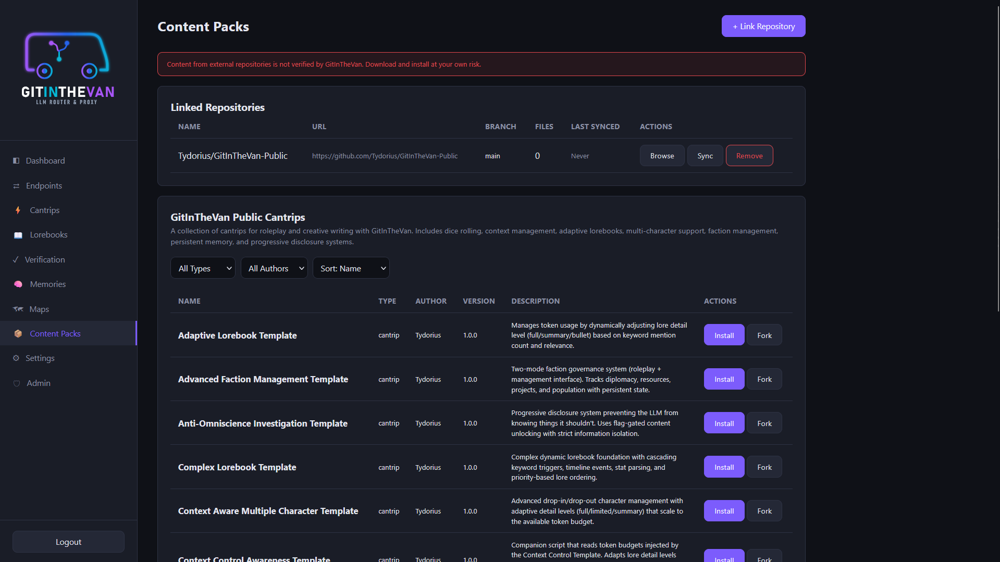

After linking or syncing, the browser shows all available files with:

- **Filter by Type**: All, Cantrips, Lorebooks, Rules, Maps
- **Filter by Author**: Filter to specific creators
- **Sort by**: Name, Recently Updated, or Type

Each file shows its name, type, author, version, and description.

### Install vs Fork

- **Install**: Creates a linked copy in your account. Tracks the repo for update notifications. You can update to the latest version or pin to a specific commit.
- **Fork**: Creates an independent copy. No link to the repo. You own and edit it freely.

Both options install the resource in a **disabled** state. You must manually enable it after reviewing.

### Safety Scanner

Before installation, every file is scanned for potential risks:

| Severity | What It Detects | Behavior |
|----------|----------------|----------|
| Critical | Network access (fetch, WebSocket), filesystem access, process execution, dynamic imports | Blocks installation |
| Warning | eval(), external URLs, infinite loops, oversized content | Allows install with alert |
| Clean | No issues found | Installs normally |

All installed items start disabled regardless of scan result.

### Managing Installed Items

The installed items panel shows everything you've installed from repos:

- **Enable/Disable**: Toggle the resource on/off
- **Uninstall**: Removes the resource from your account entirely
- **Scan badge**: Shows the scan result (Clean, Warning, Critical)

### Syncing Repos

Click **Sync** on a repo to re-fetch the latest `descriptions.json` and file list. This checks for new files and updates.

---

## 13. Settings

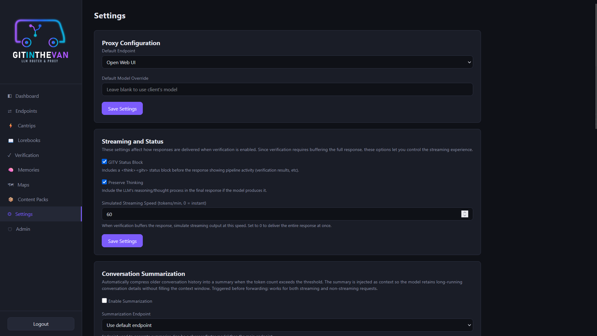

The Settings page configures your default proxy behavior, streaming UX, summarization, and pipeline features.

### Proxy Configuration

- **Default Endpoint**: Which endpoint to use when no specific routing applies
- **Debug Mode**: Capture pipeline stage data for the last 20 exchanges. View captured data on the Debug page in the sidebar.

Model configuration is now per-endpoint. Set the **Default Model** on each endpoint in the Endpoints page. The endpoint's model is used as a fallback when the client doesn't specify one.

### Streaming and Status

These settings affect how responses are delivered when verification is enabled. Since verification requires buffering the full response, these options control the streaming experience:

- **GITV Status Block**: Includes a `<think><gitv>` status block before the response showing pipeline activity
- **Preserve Thinking**: Include the LLM's reasoning/thought process in the final response
- **Simulated Streaming Speed**: When verification buffers the response, simulate streaming output at this speed (tokens/min, 0 = instant)

### Conversation Summarization

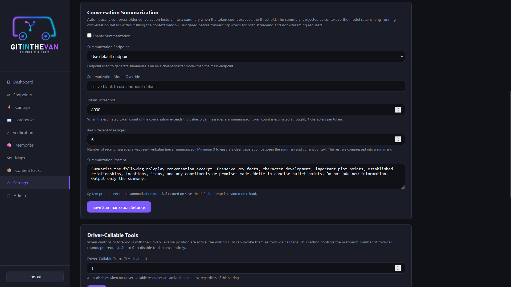

Automatically compresses long conversations to reduce token usage while preserving narrative context:

- **Enable Summarization**: Master toggle
- **Summarization Endpoint**: Which LLM endpoint to use (can be a cheaper/faster model)
- **Model Override**: Override the model name for summarization calls
- **Token Threshold**: When estimated tokens exceed this, summarization triggers (default 8000)
- **Keep Recent Messages**: Number of recent messages always sent verbatim (minimum 3)
- **Summarization Prompt**: System prompt for the summarization LLM

When summarization triggers, older dialogue is removed from the request and replaced with a single `[CONVERSATION SUMMARY]` system block. The most recent messages are always forwarded verbatim. Summaries are cached per conversation — rerolls and forks reuse the cached summary without re-calling the LLM.

### Driver-Callable Tools

Controls whether the writing LLM (Driver) can invoke cantrips as tools during generation:

- **Driver-Callable Turns**: Maximum number of tool-call rounds per request (0 = disabled). Default 1. Auto-disables when no active resources have the Driver-Callable position checked.

When enabled, a `[TOOL ACCESS]` block listing available tools is injected into the system prompt. The LLM calls tools with `<call:tool_name arg="value">` tags. Each call decrements the turn counter. When turns reach 0, the notification stops — preventing infinite loops.

### Prefill Normalization

When enabled and a trailing assistant message is detected (the "prefill" pattern), GitInTheVan converts it to a system instruction for OpenAI-compatible providers that don't support native prefill. Anthropic and Google endpoints pass through as-is since they support prefill natively.

Provider is auto-detected from the endpoint URL and model name.

### Context Budgeting

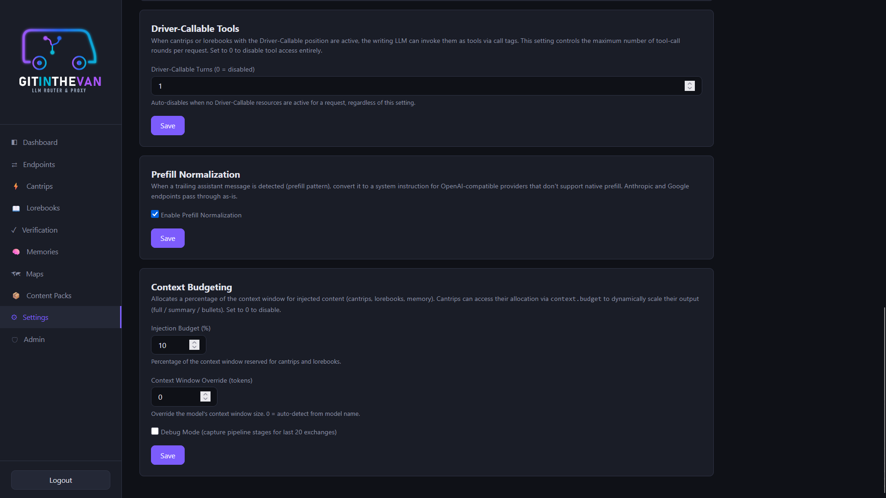

Allocates a percentage of the model's context window for injected content (cantrips, lorebooks, memory). Cantrips can access their allocation via `context.budget` to dynamically scale their output.

- **Injection Budget (%)**: Percentage of the context window reserved for injections (default 10). Set to 0 to disable budgeting entirely.
- **Context Window Override**: Manually set the model's context window size in tokens. Set to 0 to auto-detect from the model name (e.g., GPT-4o = 128K, Claude 3.5 = 200K, Gemini 2 = 1M).

When enabled, each active cantrip and lorebook receives a proportional share of the budget based on their **Budget Weight** field (found on each cantrip/lorebook edit form). Cantrips can read `context.budget.detail_level` to choose between full, summary, or bullet-point output.

### Security Settings

The following security features are configured via environment variables (`.env` file):

| Setting | Default | Description |
|---------|---------|-------------|
| `GITV_CORS_ORIGINS` | `*` | Allowed CORS origins (comma-separated) |
| `GITV_RATE_LIMIT_ENABLED` | `true` | Enable rate limiting |
| `GITV_RATE_LIMIT_PROXY_PER_MIN` | `60` | Max proxy requests per minute per client |
| `GITV_RATE_LIMIT_API_PER_MIN` | `120` | Max management API requests per minute |
| `GITV_MAX_REQUEST_BODY_SIZE` | `10485760` | Max request body size (10MB) |
| `GITV_JWT_EXPIRATION_HOURS` | `24` | JWT token lifetime |
| `GITV_MIN_PASSWORD_LENGTH` | `8` | Minimum password length (requires letter + number) |

Admin actions (user creation, deletion, password resets) are recorded in the audit log, viewable via the **Admin** page. Global caps for driver-callable turns and verification retries are also configured in the Admin page.

---

## 14. Debug

*Available to all users. Enable Debug Mode in Settings first.*

The Debug page provides full pipeline visibility for troubleshooting. When Debug Mode is enabled in Settings, GitInTheVan captures the last 20 exchanges with every pipeline stage preserved as a timeline.

The left panel shows recent captured exchanges, newest first. Each entry shows the model, timestamp, stage count, and a verified badge.

Select an exchange to see the **Pipeline Timeline**:

- Each pipeline stage appears as a numbered row, showing its label, a short detail summary, and a **changed** badge if it modified the messages
- Click any stage to expand it and see the before/after message snapshots, metadata (matched keywords, memory keys, budget allocation, cantrip debug logs, tool calls, etc.), and the setting that controls it
- Response-side stages (verification, cantrips, forbidden words, memory extraction) show content before/after
- The final response content and verification details (if enabled) appear at the bottom

Tags detected in the original request are shown at the top of the timeline.

Use **Clear All** to wipe captured exchanges. Captures are automatically pruned to the most recent 20 per user.

---

## 15. Admin

*Admin only. The Admin link in the sidebar is only visible to admin accounts.*

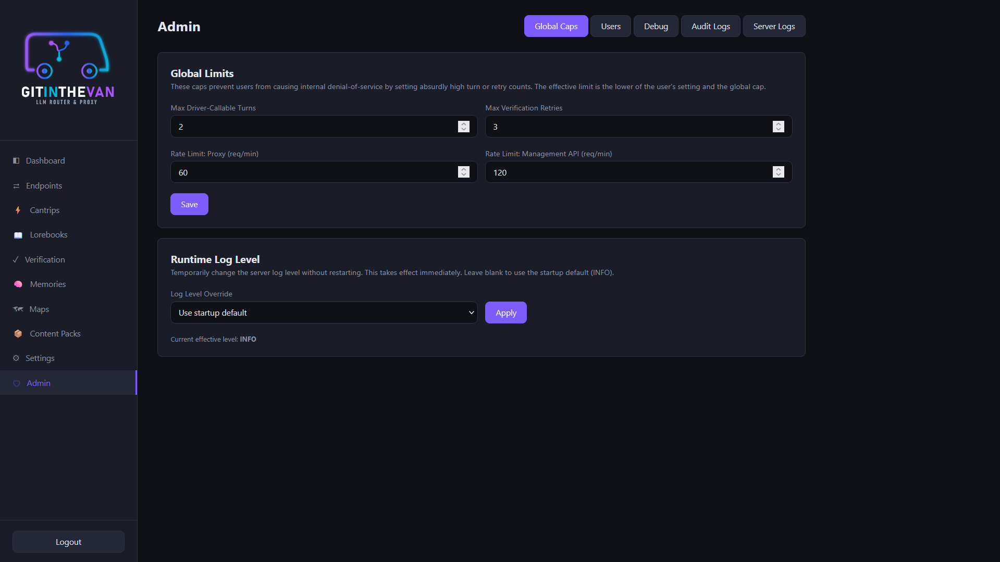

The Admin page provides system-wide management with four tabs: **Global Caps**, **Users**, **Audit Logs**, and **Server Logs**. Debug is now a separate page in the sidebar.

### Global Caps Tab

Prevents users from causing internal denial-of-service by setting absurdly high turn or retry counts. The effective limit is the lower of the user's setting and the global cap — user preferences are not overwritten.

- **Max Driver-Callable Turns**: Global cap for driver-callable tool turns per request (default 2)
- **Max Verification Retries**: Global cap for verification resubmission retries (default 3)
- **Rate Limit: Proxy**: Max proxy requests per minute (default 60)
- **Rate Limit: Management API**: Max management API requests per minute (default 120)

### Runtime Log Level

The Global Caps tab also includes a Runtime Log Level override. Temporarily change the server log level without restarting — changes take effect immediately.

- Select a level from the dropdown (DEBUG through CRITICAL)
- Click **Apply** to change the level at runtime
- Leave blank to use the startup default (from `GITV_LOG_LEVEL`)
- Click **Reset to Default** to clear the override

### Users Tab

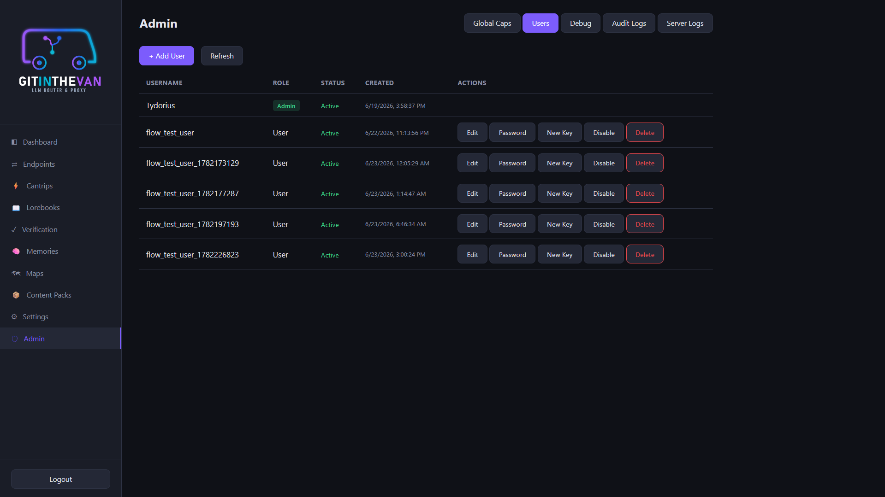

Full user management. Each user row shows:
- **Username**
- **Role**: Admin or User
- **Status**: Active or Disabled
- **Created**: Account creation timestamp

**Actions (non-admin users only):**

- **Edit**: Rename the user
- **Password**: Reset the user's password
- **New Key**: Regenerate the user's API key (the old key stops working immediately; the new key is shown once)
- **Disable/Enable**: Block or unblock the user. Disabled users cannot log in and their proxy requests are rejected
- **Delete**: Permanently delete the user and **all** their data (endpoints, cantrips, lorebooks, memories, summaries, forbidden words, verification rules/logs, settings, chat data)

Admin users cannot be disabled or deleted.

Click **"+ Add User"** and enter a username and password. After creation, the user's API key is shown once — save it immediately.

### Audit Logs Tab

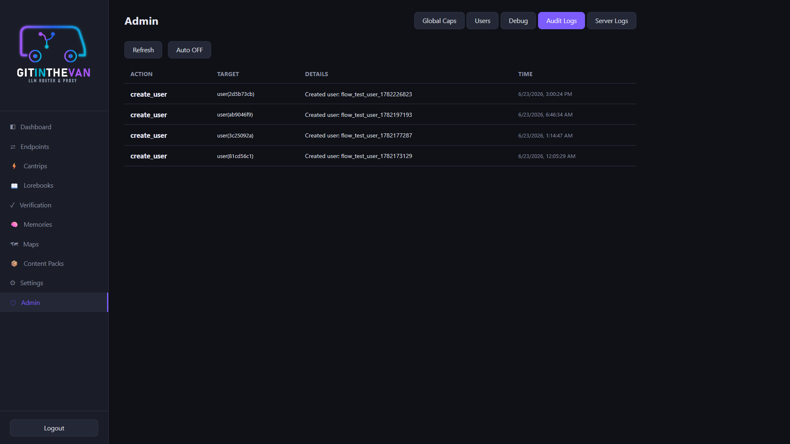

Read-only view of admin actions. Each entry shows the action type, target, details, and timestamp. Logs are auto-pruned to 1000 entries. Use **Refresh** or toggle **Auto** for automatic refresh every 15 seconds.

### Server Logs Tab

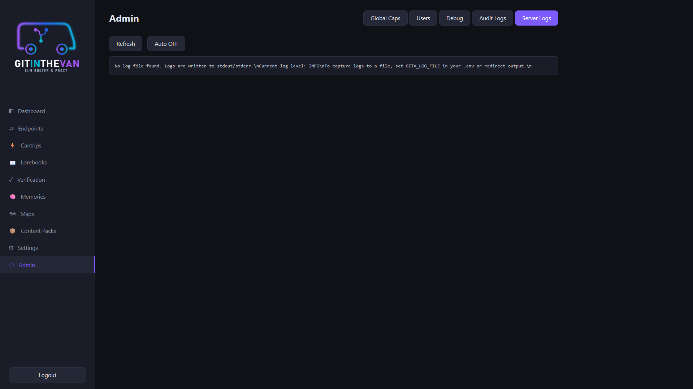

Read-only view of recent server log output (last 200 lines). Logs are read from the file configured by `GITV_LOG_FILE` (auto-creates `data/logs/gitinthevan.log` if unset). Use **Refresh** or toggle **Auto** for automatic refresh every 15 seconds.
